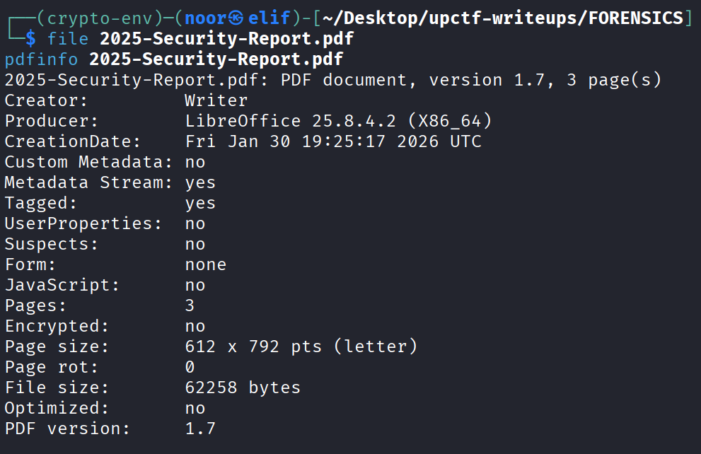
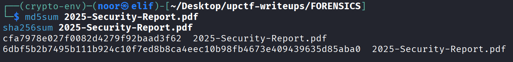
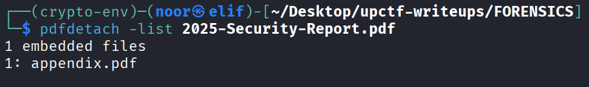
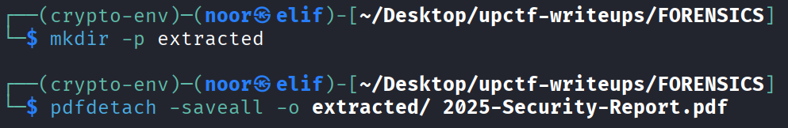
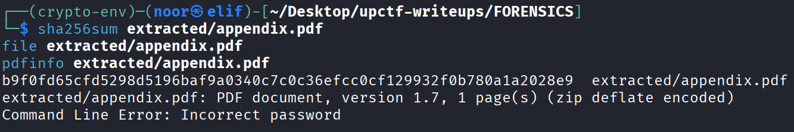
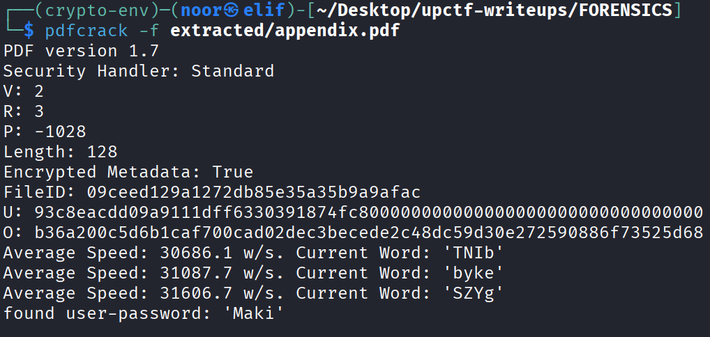
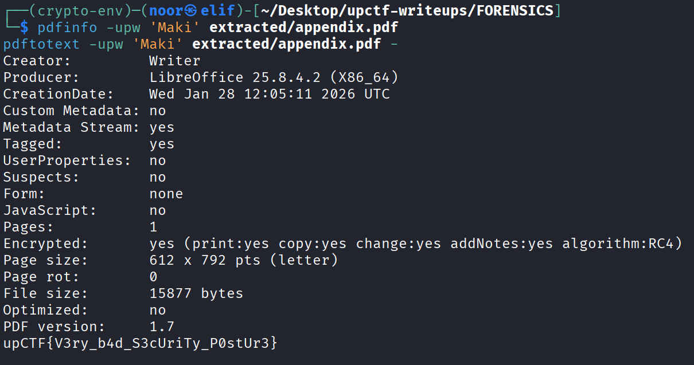

# xSTF's Annual Security Report - Forensics Write-Up

**Category:** Forensics  
**Difficulty:** Easy  
**Challenge:** xSTF's Annual Security Report  
**Files:** `2025-Security-Report.pdf`

---

## TL;DR

At first glance, `2025-Security-Report.pdf` looked like a normal internal report with nothing sensitive inside. The visible pages were basically a decoy.

The real lead was that the PDF had an **embedded attachment** named `appendix.pdf`. After extracting it with `pdfdetach`, I found that the appendix was password-protected. Running `pdfcrack` recovered the user password:

> **Maki**

Using that password to decrypt the appendix revealed the flag directly:

> **upCTF{V3ry_b4d_S3cUriTy_P0stUr3}**

---

## Environment / Tools

This was a clean static forensics solve. I did not need to patch or modify anything.

* **Linux:** `file`, `sha256sum`, `pdfinfo`, `pdfdetach`, `pdftotext`
* **Password recovery:** `pdfcrack`
* **Optional inspection:** `strings`, `exiftool`, `qpdf`

---

## Artifact Fingerprint

### File identification

The first step was just to fingerprint the supplied document and make sure I was not missing something obvious.

```bash
file 2025-Security-Report.pdf
pdfinfo 2025-Security-Report.pdf
```


Relevant observations:

* it is a **3-page PDF 1.7** document
* it is **not encrypted**
* it was produced by **LibreOffice / Writer**
* nothing immediately suspicious shows up from the visible metadata alone

That already suggested a very common forensics pattern: the visible content is probably not the real payload.

---

### Hashes (reproducibility)

```text
SHA256 (2025-Security-Report.pdf): 6dbf5b2b7495b111b924c10f7ed8b8ca4eec10b98fb4673e409439635d85aba0
SHA256 (appendix.pdf):            b9f0fd65cfd5298d5196baf9a0340c7c0c36efcc0cf129932f0b780a1a2028e9
```


I like recording hashes early so I can always prove I am working from the same artifacts later.

---

### Visible content vs hidden content

Reading the report normally did not reveal anything useful. The document looked like a bland internal security summary.

That meant the shortest next step was not to overthink the text itself, but to inspect the PDF structure for:

* embedded attachments
* trailing data
* hidden objects
* password-protected secondary material

That turned out to be exactly the right move.

---

## Solution Steps (single consolidated section)

### Step 1 — Check whether the PDF contains embedded files

Instead of spending too long on the visible report text, I listed any attached files inside the PDF:

```bash
pdfdetach -list 2025-Security-Report.pdf
```


Output:

```text
1 embedded files
1: appendix.pdf
```

That was the real pivot point of the challenge.

The report itself was just a wrapper. The interesting artifact was the hidden attachment.

---

### Step 2 — Extract the hidden appendix

Once I confirmed the embedded file existed, I extracted it directly:

```bash
mkdir -p extracted
pdfdetach -saveall -o extracted/ 2025-Security-Report.pdf
```


Now I had:

```text
extracted/appendix.pdf
```

I fingerprinted it next:

```bash
sha256sum extracted/appendix.pdf
file extracted/appendix.pdf
pdfinfo extracted/appendix.pdf
```


The important result was:

```text
Command Line Error: Incorrect password
```

So the embedded appendix was not just a random extra file — it was the protected payload.

---

### Step 3 — Recover the appendix password

At that point the path was straightforward: recover the password rather than trying to guess anything manually.

I used `pdfcrack` against the extracted file:

```bash
pdfcrack -f extracted/appendix.pdf
```


Relevant output:

```text
PDF version 1.7
Security Handler: Standard
V: 2
R: 3
P: -1028
Length: 128
Encrypted Metadata: True
...
found user-password: 'Maki'
```

So the valid user password for the appendix was:

> **Maki**

That also fits the theme of the challenge pretty well: the report talks about weak security posture, and the hidden appendix is protected with a weak recoverable password.

---

### Step 4 — Decrypt the appendix and extract the content

With the password in hand, I could finally read the appendix.

I used either of these:

```bash
pdfinfo -upw 'Maki' extracted/appendix.pdf
pdftotext -upw 'Maki' extracted/appendix.pdf -
```


The second command printed the flag directly from the decrypted PDF contents:

```text
upCTF{V3ry_b4d_S3cUriTy_P0stUr3}
```

At that point the solve was complete.

---

### Step 5 — Why this challenge is nice

What I liked here is that the challenge did not require anything exotic.

The intended workflow was just solid PDF forensics:

1. fingerprint the supplied file
2. do not trust the visible pages alone
3. enumerate embedded objects
4. extract the hidden attachment
5. recover the password
6. read the real payload

So the difficulty was not in a complicated cipher or file format trick. The trick was simply noticing that the important content was **not on the visible pages at all**.

---

## Reproducible Solve Commands

This is the exact minimal command flow I used:

```bash
file 2025-Security-Report.pdf
pdfinfo 2025-Security-Report.pdf
pdfdetach -list 2025-Security-Report.pdf
mkdir -p extracted
pdfdetach -saveall -o extracted/ 2025-Security-Report.pdf
sha256sum extracted/appendix.pdf
pdfinfo extracted/appendix.pdf 2>&1
pdfcrack -f extracted/appendix.pdf
pdftotext -upw 'Maki' extracted/appendix.pdf -
```

If I wanted to reduce it to the core solve only, this was enough:

```bash
mkdir -p extracted && \
pdfdetach -saveall -o extracted/ 2025-Security-Report.pdf && \
pdfcrack -f extracted/appendix.pdf && \
pdftotext -upw 'Maki' extracted/appendix.pdf -
```

---

## Final Answer

**Flag:**

> **upCTF{V3ry_b4d_S3cUriTy_P0stUr3}**

---

## Notes / Takeaways

* When a PDF looks too clean, I always check for **embedded files** early.
* A harmless-looking document can still be a container for the real artifact.
* In forensics challenges, the shortest path is often just careful enumeration, not deep speculation.
* `pdfdetach` is ridiculously high-value for PDF-based CTFs.
* Once I saw the appendix was encrypted, using `pdfcrack` was the most direct and reproducible route.
