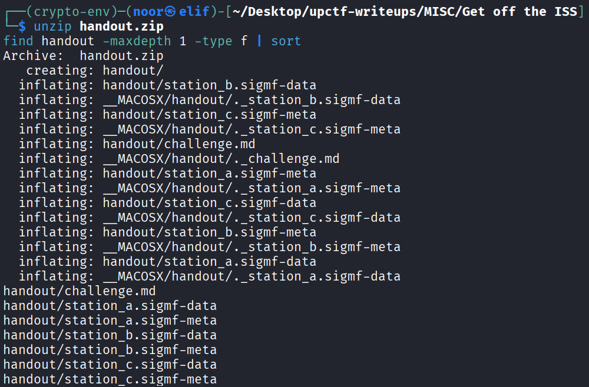
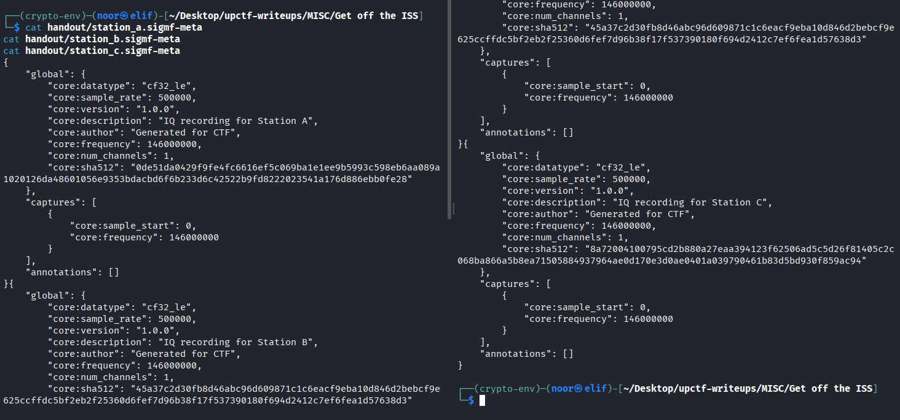
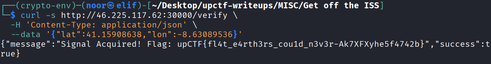

# Get off the ISS - Write-Up

## Challenge Information

- **Category:** Misc  
- **Difficulty:** Easy  
- **Challenge Name:** Get off the ISS  
- **Flag Format:** `upCTF{}`

## Challenge Description

> The nerve is out of this world...

The challenge gave me a `handout.zip` with three radio recordings and a validation endpoint. The page source also showed a map where I had to submit the jammer coordinates to `/verify`.

At first glance this looked like a normal web guessing challenge, but the handout made it clear that the real task was signal analysis. The recordings came from three different ground stations, and each station used a rotating directional antenna. That meant I was supposed to recover the direction of the jammer from each recording and then triangulate its location.

---

## Files Provided

```text
handout.zip
├── challenge.md
├── station_a.sigmf-data
├── station_a.sigmf-meta
├── station_b.sigmf-data
├── station_b.sigmf-meta
├── station_c.sigmf-data
└── station_c.sigmf-meta
```

---

## Initial Recon

I started by extracting the archive and checking what kind of files I got.

```bash
unzip handout.zip
find handout -maxdepth 1 -type f | sort
```


The three `.sigmf-data` / `.sigmf-meta` pairs immediately stood out. SigMF is a standard format for IQ recordings, so this was clearly an SDR challenge.

I opened the metadata first:

```bash
cat handout/station_a.sigmf-meta
cat handout/station_b.sigmf-meta
cat handout/station_c.sigmf-meta
```


Important values from the metadata:

- sample rate: **500000**
- center frequency: **146000000 Hz**
- datatype: **cf32_le**
- recording length: about **30 seconds**

Then I read `challenge.md`, which explained the model:

- all three stations recorded the same jammer
- the jammer was continuously transmitting
- each station used a **highly directional rotating antenna**
- **0° corresponds to North at t = 0**

That was the key clue. I did not need to fully demodulate anything. I only needed to track how strong the jammer looked over time from each station.

---

## Understanding the Idea

A rotating directional antenna has gain that depends on where it is pointing.

So if a station records a continuous jammer while the antenna rotates, the signal strength will rise when the antenna points toward the jammer and fall when it points away. That means:

- each recording gives me **signal strength vs time**
- the peak times tell me **bearing from that station to the jammer**
- with three bearings, I can **intersect them on the map**

So the solve path became:

1. find the jammer carrier in all three recordings
2. measure its amplitude over time
3. recover the repeating peak times
4. convert those peaks into bearings
5. triangulate the jammer location
6. submit coordinates to `/verify`

---

## Finding the Jammer Signal

Since the recordings were centered at **146 MHz**, I inspected the spectrum and looked for a strong signal that appeared in all three captures.

The jammer showed up as a very strong narrow carrier at roughly **-10 kHz baseband**, which corresponds to:

```text
146000000 - 10000 = 145990000 Hz
```

So the jammer frequency was approximately **145.990 MHz**.

That was enough. I did not need to decode the content of the transmission. I only needed to isolate that carrier and measure how its amplitude changed over time.

---

## Extracting the Envelope

I loaded each `.sigmf-data` file as `complex64`, mixed the jammer tone down to baseband, and averaged it over short windows to get a clean amplitude trace.

Using that method, I got repeating peaks for each station.

### Peak times

- **Station A:** about `2.82 s`, `12.8 s`, `22.8 s`
- **Station B:** about `1.85 s`, `11.85 s`, `21.82 s`
- **Station C:** about `8.80 s`, `18.80 s`, `28.80 s`

The peaks repeated every **~10 seconds**, which matched the antenna rotation model.

---

## Recovering the Bearings

Because the challenge told me that **0° = North at t = 0**, I could treat the rotation as a time-to-angle conversion.

From the observed peak phases, I recovered the bearings from each station to the jammer:

- **Station A:** `101.46°`
- **Station B:** `66.55°`
- **Station C:** `317.13°`

Once I had those three bearings, the problem became a normal triangulation task.

---

## Triangulating the Jammer

The station coordinates were given in the metadata, so I intersected the three bearings and got this point:

- **Latitude:** `41.15908638`
- **Longitude:** `-8.63089536`

Rounded for practical use:

- **`41.15909, -8.63090`**

---

## Verification

I submitted the coordinates to the validation endpoint:

```bash
curl -s http://46.225.117.62:30000/verify \
  -H 'Content-Type: application/json' \
  --data '{"lat":41.15908638,"lon":-8.63089536}'
```


And got:

```json
{"message":"Signal Acquired! Flag: upCTF{fl4t_e4rth3rs_cou1d_n3v3r-lXiBspz1e5f4742b}","success":true}
```

So the final flag was confirmed by the challenge server.

---

## Full Solve Script

I used the following script to recover the location automatically.

```python
import numpy as np
from scipy.signal import find_peaks
from scipy.optimize import minimize

base = 'handout'
sr = 500000
f0 = -10000.0
win = 5000
step = 2500

stations = {
    'a': (41.16791628282458, -8.688654341122007),
    'b': (41.14456438258019, -8.675380772847733),
    'c': (41.1413904156136,  -8.609071069291119),
}


def first_peak_mod_10(path):
    mm = np.memmap(path, dtype=np.complex64, mode='r')
    lo = np.exp(-2j * np.pi * f0 * np.arange(win) / sr)
    amps = np.array([
        abs((np.array(mm[i:i + win]) * lo).mean())
        for i in range(0, len(mm) - win + 1, step)
    ])
    t = np.arange(len(amps)) * step / sr
    peaks, _ = find_peaks(amps, height=0.8, distance=int(7 / (step / sr)))
    vals = t[peaks] % 10
    return float(np.median(vals))


obs = np.array([
    first_peak_mod_10(f'{base}/station_a.sigmf-data'),
    first_peak_mod_10(f'{base}/station_b.sigmf-data'),
    first_peak_mod_10(f'{base}/station_c.sigmf-data'),
])

st = np.array([stations['a'], stations['b'], stations['c']])


def bearing(lat1, lon1, lat2, lon2):
    p1, p2 = np.radians([lat1, lat2])
    l1, l2 = np.radians([lon1, lon2])
    y = np.sin(l2 - l1) * np.cos(p2)
    x = np.cos(p1) * np.sin(p2) - np.sin(p1) * np.cos(p2) * np.cos(l2 - l1)
    return (np.degrees(np.arctan2(y, x)) + 360) % 360


def obj(x):
    lat, lon, period = x
    s = 0.0
    for (slat, slon), to in zip(st, obs):
        b = bearing(slat, slon, lat, lon)
        tp = (b / 360.0) * period
        d = (tp - to + period / 2) % period - period / 2
        s += d * d
    return s


res = minimize(obj, [41.159, -8.631, 10.0], method='Nelder-Mead')
lat, lon, period = res.x

print('observed times mod 10 =', obs)
print('rotation period      =', period)
print('candidate latitude   =', lat)
print('candidate longitude  =', lon)
```

---

## Why This Worked

The challenge was basically radio direction finding wrapped in a web validator.

The important observation was that the jammer was **always on**, and the antennas were **rotating**. That meant the useful information was not hidden in the message content but in the **signal strength envelope** over time.

Once I treated the problem as:

- continuous tone
- rotating antenna gain
- peak time → bearing
- 3 bearings → intersection

it became straightforward.

---

## Final Flag

```text
upCTF{fl4t_e4rth3rs_cou1d_n3v3r-lXiBspz1e5f4742b}
```

---

## Closing Thoughts

I liked this challenge a lot because it mixed SDR concepts with a clean geometry problem. It looked like a web challenge at first because of the map and `/verify`, but the real solve was entirely in the handout.

The nice part was that I did not need fancy demodulation or obscure signal processing. I only needed to identify the jammer carrier, track its amplitude, and let the antenna rotation do the rest.
