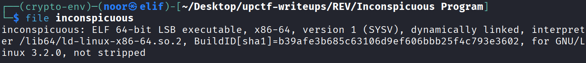
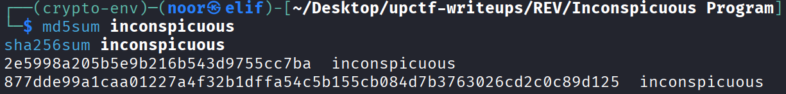
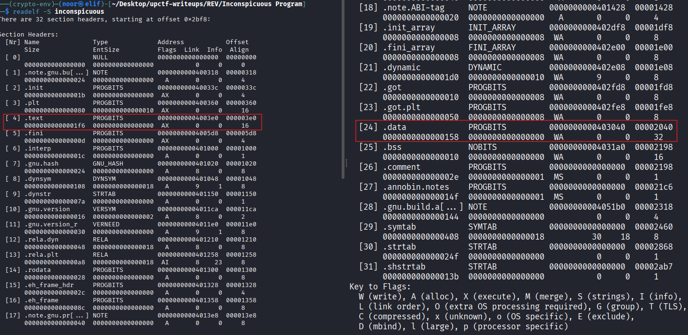
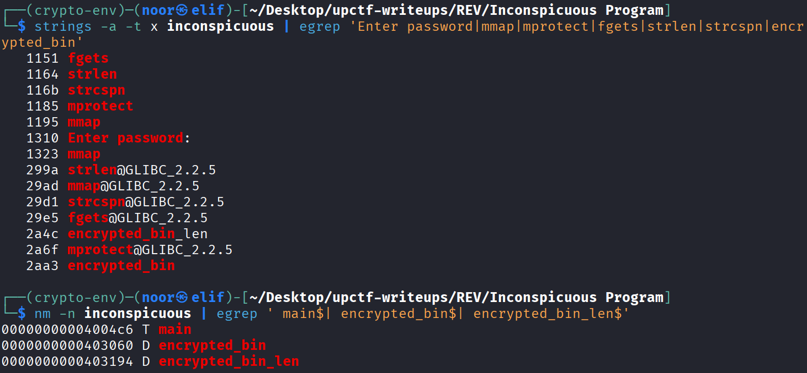
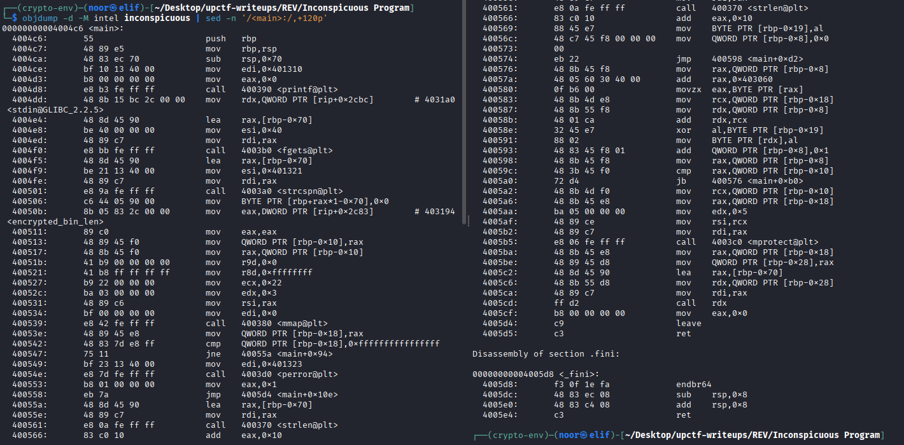
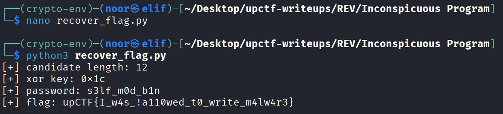
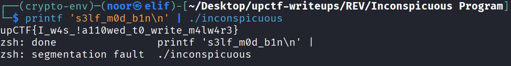

# Inconspicuous Program - Reverse Engineering Write-Up

**Category:** Reverse Engineering
**Difficulty:** Easy
**Challenge:** Inconspicuous Program
**Files:** `inconspicuous`

---

## TL;DR

The binary is only a tiny ELF loader. It reads our input, derives a **single-byte XOR key** from the input length, decrypts an embedded code blob into executable memory, and jumps into it.

The key is computed as:

```text
key = strlen(input) + 0x10
```

Bruteforcing the possible input lengths shows that a length of **12** produces a valid x86-64 function. Decrypting the payload with that key reveals a direct byte-by-byte password check for:

> **s3lf_m0d_b1n**

On success, the payload prints the flag:

> **upCTF{I_w4s_!a110wed_t0_write_m4lw4r3}**

---

## Environment / Tools

Static analysis was enough:

* **Linux:** `file`, `readelf`, `strings`, `nm`, `objdump`, `python3`

---

## Artifact Fingerprint

### File identification

```bash
file inconspicuous
# ELF 64-bit LSB executable, x86-64, dynamically linked, not stripped
```


This already suggests a normal Linux userland binary rather than a packed archive or script wrapper.

### Hashes (reproducibility)

```text
MD5:    2e5998a205b5e9b216b543d9755cc7ba
SHA256: 877dde99a1caa01227a4f32b1dffa54c5b155cb084d7b3763026cd2c0c89d125
```


### Sections

```bash
readelf -S inconspicuous
```


Important parts:

* `.text` at **VMA `0x4003e0`**, **file offset `0x3e0`**
* `.data` at **VMA `0x403040`**, **file offset `0x2040`**

The interesting symbol lives inside `.data`, so this mapping matters when converting a runtime address into a file offset.

### Suspicious strings and symbols

```bash
strings -a -t x inconspicuous | egrep 'Enter password|mmap|mprotect|fgets|strlen|strcspn|encrypted_bin'
nm -n inconspicuous | egrep ' main$| encrypted_bin$| encrypted_bin_len$'
```


Relevant output:

```text
1151 fgets
1164 strlen
116b strcspn
1185 mprotect
1195 mmap
1310 Enter password:

00000000004004c6 T main
0000000000403060 D encrypted_bin
0000000000403194 D encrypted_bin_len
```

At this point the overall shape is already clear:

* read user input
* allocate memory with `mmap`
* decrypt some data from `.data`
* mark it executable with `mprotect`
* call it as code

So the visible `main()` is only a loader stub.

---

## Solution Steps (single consolidated section)

### Step 1 — Reverse the loader logic in `main`

Disassembling `main` shows the full execution flow:

```bash
objdump -d -M intel inconspicuous | sed -n '/<main>:/,+120p'
```

Key block:

```asm
4004c6 <main>:
  ...
  printf("Enter password: ")
  fgets(buf, 0x40, stdin)
  strcspn(buf, "\n")
  buf[len] = 0

  mov eax, DWORD PTR [rip+0x2c83]    ; encrypted_bin_len
  ...
  call mmap
  ...
  call strlen
  add eax, 0x10                      ; key = strlen(input) + 0x10
  ...
  movzx eax, BYTE PTR [encrypted_bin+i]
  xor al, BYTE PTR [rbp-0x19]        ; decrypt byte with single-byte key
  mov BYTE PTR [mapped+i], al
  ...
  call mprotect
  ...
  call rdx                           ; jump into decrypted blob
```


This is the whole trick. The program does **not** verify the password directly in `.text`. Instead, it decrypts a second-stage function into memory and executes it.

The important detail is that the XOR key depends only on the **input length**, not the input contents.

---

### Step 2 — Convert the encrypted blob symbol into a file offset

From `nm`:

```text
encrypted_bin      = 0x403060
encrypted_bin_len  = 0x403194
```

From `readelf -S`:

```text
.data VMA         = 0x403040
.data file offset = 0x2040
```

So the file offset of `encrypted_bin` is:

```text
0x2040 + (0x403060 - 0x403040) = 0x2060
```

And `encrypted_bin_len` is a 4-byte value stored at:

```text
0x2040 + (0x403194 - 0x403040) = 0x2194
```

Reading that value gives the blob length:

```text
0x134 bytes
```

---

### Step 3 — Recover the correct XOR key

Since the key is:

```text
strlen(input) + 0x10
```

we only need the **correct input length** before we can decrypt the payload cleanly.

I bruteforced the possible lengths and checked which candidate produced a sane x86-64 function prologue. The winning length was:

```text
12
```

So the XOR key becomes:

```text
0x0c + 0x10 = 0x1c
```

That means the real checker is just:

```text
decrypted[i] = encrypted_bin[i] ^ 0x1c
```

---

### Step 4 — Disassemble the decrypted payload

After XORing the 0x134-byte blob with `0x1c`, the result starts with a clean function prologue:

```text
55 48 89 e5 48 89 7d f8 ...
```

Disassembling the decrypted bytes gives a straightforward verifier:

```asm
0:   55                      push   rbp
1:   48 89 e5                mov    rbp,rsp
4:   48 89 7d f8             mov    QWORD PTR [rbp-0x8],rdi
...
f:   3c 73                   cmp    al,0x73
...
22:  3c 33                   cmp    al,0x33
...
35:  3c 6c                   cmp    al,0x6c
...
48:  3c 66                   cmp    al,0x66
...
5b:  3c 5f                   cmp    al,0x5f
...
6e:  3c 6d                   cmp    al,0x6d
...
81:  3c 30                   cmp    al,0x30
...
94:  3c 64                   cmp    al,0x64
...
a7:  3c 5f                   cmp    al,0x5f
...
ba:  3c 62                   cmp    al,0x62
...
c9:  3c 31                   cmp    al,0x31
...
d8:  3c 6e                   cmp    al,0x6e
...
e7:  84 c0                   test   al,al
```

Converting those bytes to ASCII gives:

```text
73 33 6c 66 5f 6d 30 64 5f 62 31 6e
s  3  l  f  _  m  0  d  _  b  1  n
```

So the required password is:

> **s3lf_m0d_b1n**

The final `test al, al` checks that byte 12 is `0x00`, so the checker also enforces the exact string length.

---

### Step 5 — Recover the embedded flag from the success path

The success path is even simpler. Right after the password checks pass, the decrypted payload performs a raw `write` syscall:

```asm
eb:  48 c7 c0 01 00 00 00    mov    rax,0x1
f2:  48 c7 c7 01 00 00 00    mov    rdi,0x1
f9:  48 8d 35 0a 00 00 00    lea    rsi,[rip+0xa]
100: 48 c7 c2 27 00 00 00    mov    rdx,0x27
107: 0f 05                   syscall
109: c3                      ret
```

The bytes right after that `lea` target are the printed string itself:

```text
upCTF{I_w4s_!a110wed_t0_write_m4lw4r3}\n
```

So once the correct password is supplied, the program prints:

> **upCTF{I_w4s_!a110wed_t0_write_m4lw4r3}**

---

### Step 6 — Extract everything reproducibly with Python

To avoid manual byte-copying, I wrote a small extractor that:

* reads the encrypted blob from the file
* tries all plausible input lengths
* decrypts the payload
* looks for `upCTF{...}`
* reconstructs the password from the `cmp al, imm8` sequence

```python
#!/usr/bin/env python3
from pathlib import Path
import struct

blob = Path("inconspicuous").read_bytes()

ENC_OFF = 0x2060
LEN_OFF = 0x2194

enc_len = struct.unpack_from("<I", blob, LEN_OFF)[0]
enc = blob[ENC_OFF:ENC_OFF + enc_len]

for length in range(0, 0x40):
    key = (length + 0x10) & 0xff
    dec = bytes(b ^ key for b in enc)

    if b"upCTF{" not in dec:
        continue

    start = dec.index(b"upCTF{")
    end = dec.index(b"}", start) + 1
    flag = dec[start:end].decode()

    password = []
    for i in range(len(dec) - 1):
        if dec[i] == 0x3C:  # cmp al, imm8
            password.append(dec[i + 1])

    print(f"[+] candidate length: {length}")
    print(f"[+] xor key: 0x{key:02x}")
    print(f"[+] password: {bytes(password).decode()}")
    print(f"[+] flag: {flag}")
```

Running it gives:

```text
[+] candidate length: 12
[+] xor key: 0x1c
[+] password: s3lf_m0d_b1n
[+] flag: upCTF{I_w4s_!a110wed_t0_write_m4lw4r3}
```


---

### Step 7 — Dynamic validation

The recovered password works directly against the original binary:

```bash
printf 's3lf_m0d_b1n\n' | ./inconspicuous
# upCTF{I_w4s_!a110wed_t0_write_m4lw4r3}
```


One small quirk: the program may segfault after printing the flag. That happens because the success-path payload returns awkwardly after the in-memory stub finishes.

That crash does **not** affect the result. The flag is already printed before it happens.

---

## Final Answer

**Password:**

> **s3lf_m0d_b1n**

**Flag:**

> **upCTF{I_w4s_!a110wed_t0_write_m4lw4r3}**

---

## Notes / Takeaways

* A tiny `main()` plus `mmap`/`mprotect` is a strong hint that the real logic is hidden in a runtime-decrypted payload.
* Here, the decryption key depended only on **input length**, which makes the problem much easier once that pattern is spotted.
* The actual verifier was not obfuscated at all — after decryption it was just a byte-by-byte compare followed by a raw `write` syscall.
* On small ELF crackmes, it is often worth checking `.data` symbols and reconstructing runtime-generated code instead of over-focusing on the visible `.text` section.
