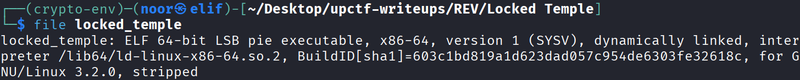
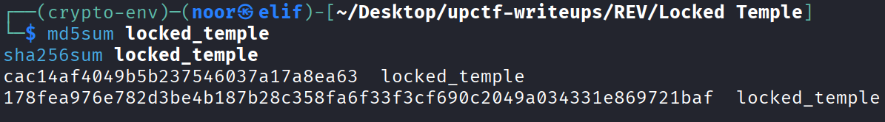
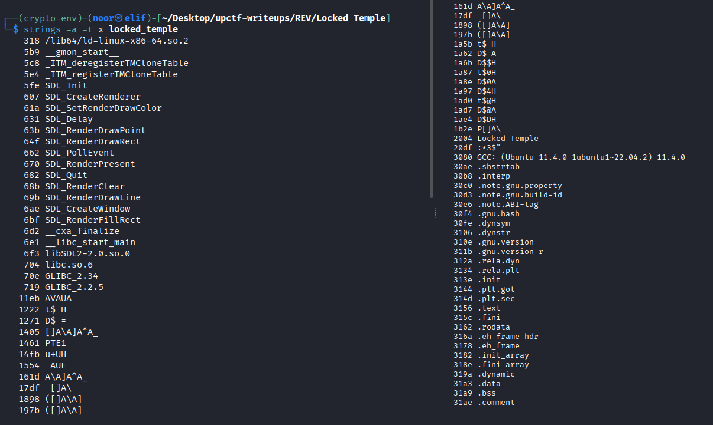
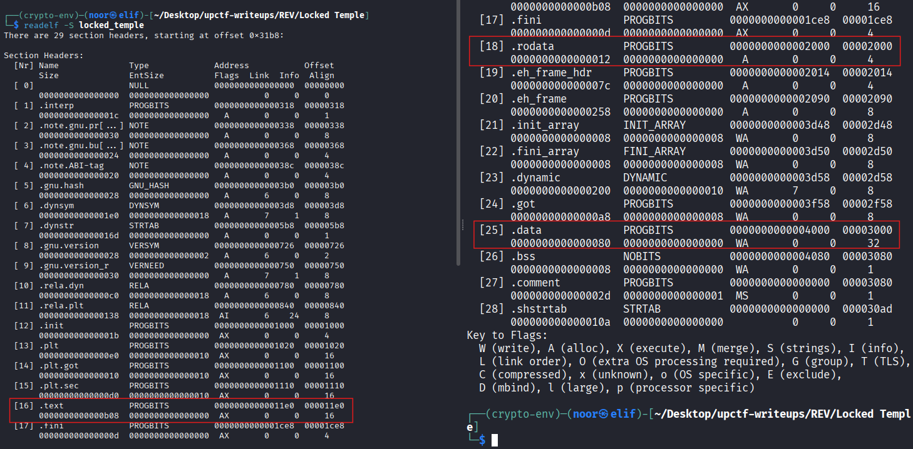
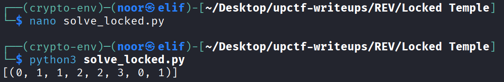

# Locked Temple - Reverse Engineering Write-Up

**Category:** Reverse Engineering  
**Difficulty:** Easy  
**Challenge:** Locked Temple  
**Files:** `locked_temple`

---

## TL;DR

The binary stores the real check data in `.data`, then decrypts it at startup with a simple XOR routine.

After reconstructing the verifier, the only valid 8-plate sequence is:

> **01122301**

The final `_SECRETDIGIT` is not stored as text. Instead, the success routine draws a golden glyph on the screen, and that glyph is a stylized:

> **7**

So the final flag is:

> **upCTF{01122301_7}**

---

## Environment / Tools

Static analysis was enough to solve this challenge:

* **Linux:** `file`, `strings`, `readelf`, `objdump`
* **Python 3:** small script to reproduce the check logic

Optional:

* **Linux GUI + SDL2** to run the binary and visually confirm the result

---

## Artifact Fingerprint

### File identification

```bash
file locked_temple
# ELF 64-bit LSB pie executable, x86-64, dynamically linked, stripped
```


This already tells us a few useful things:

* It is a **Linux ELF**
* It is **PIE**, so runtime addresses will be relocated
* It is **stripped**, so function names are gone
* It links against **SDL2**, which matches the challenge description about needing a GUI

---

### Hashes (reproducibility)

```text
MD5:    cac14af4049b5b237546037a17a8ea63
SHA256: 178fea976e782d3be4b187b28c358fa6f33f3cf690c2049a034331e869721baf
```


---

### Interesting strings

```bash
strings -a -t x locked_temple
```


Relevant output is very small:

```text
6f3 libSDL2-2.0.so.0
704 libc.so.6
2004 Locked Temple
3080 GCC: (Ubuntu 11.4.0-1ubuntu1~22.04.2) 11.4.0
```

There is **no embedded flag**, no obvious password, and no useful success/failure text. That is a good sign that the real answer is hidden in the program logic rather than in plain strings.

---

### Sections

```bash
readelf -S locked_temple
```


Important parts:

* `.text` at **VMA `0x11e0`**, **file offset `0x11e0`**
* `.rodata` at **VMA `0x2000`**, **file offset `0x2000`**
* `.data` at **VMA `0x4000`**, **file offset `0x3000`**

The `.data` section matters the most here, because the plate positions and the encrypted verification bytes both live there.

---

## Solution Steps (single consolidated section)

### Step 1 — Identify what the program actually does

Disassembling `main` quickly shows the binary is a small SDL-based movement game.

The player position is tracked with two integers, and movement uses the usual keys:

* `W` → move up
* `A` → move left
* `S` → move down
* `D` → move right

The coordinates are clamped to a 10x8 board:

* `x` in `[0..9]`
* `y` in `[0..7]`

So the obvious next question is: **where are the pressure plates stored, and how are they checked?**

---

### Step 2 — Recover the pressure plate mapping

Inside `main`, the program compares the current player position against a small table in `.data` at `0x4060`.

Dumping that region gives:

```text
0x4060: 02 00 00 00 01 00 00 00
0x4068: 07 00 00 00 01 00 00 00
0x4070: 02 00 00 00 06 00 00 00
0x4078: 07 00 00 00 06 00 00 00
```

Interpreting that as four `(x, y)` pairs:

* `(2, 1)`
* `(7, 1)`
* `(2, 6)`
* `(7, 6)`

The challenge description already tells us the numbering scheme:

```text
0  1
2  3
```

So the plate mapping is:

* `0 -> (2,1)`
* `1 -> (7,1)`
* `2 -> (2,6)`
* `3 -> (7,6)`

That confirms the player is meant to step on **eight plate IDs**, each one chosen from `{0,1,2,3}`.

---

### Step 3 — Find the sequence buffer and verification trigger

When the player stands on one of those four coordinates, `main` calls the function at `0x1c40`.

That function stores the pressed plate index into a small state structure:

* `state+0x0` → number of entered plates
* `state+0x4 .. state+0xb` → the 8 plate values
* `state+0xc` → solved flag

The logic is straightforward:

* append plate IDs until the count reaches 8
* once 8 presses are collected, jump into the verification routine at `0x1c68`

So from here the real target becomes the checker at `0x1c68`.

---

### Step 4 — Reconstruct the startup decryption

Before the game loop starts, `main` calls the function at `0x1bc0`.

That routine XOR-decrypts three 8-byte regions inside `.data` and also resets the sequence state.

The most important block is the one at `0x4020`, because the verifier later reads directly from it.

Raw bytes in the file before initialization:

```text
0x4020: 71 22 90 11 63 74 81 52
```

The first XOR loop in `0x1bc0` applies the sequence:

```text
00 05 0a 0f 14 19 1e 23
```

Byte by byte, that produces:

```text
71^00 = 71
22^05 = 27
90^0a = 9a
11^0f = 1e
63^14 = 77
74^19 = 6d
81^1e = 9f
52^23 = 71
```

So the decoded verifier bytes are:

```text
71 27 9a 1e 77 6d 9f 71
```

At this point the challenge becomes much easier, because the rest is just emulating the check logic with the correct bytes.

---

### Step 5 — Recover the exact verification logic

The verification routine at `0x1c68` does **not** compare against a fixed literal sequence. Instead, it derives the expected plate values on the fly.

The first expected plate is computed as:

```c
expected0 = (decoded[0] ^ 0x55) & 3;
```

For the remaining seven positions, the code does this pattern:

```c
v = ((11 * i) ^ 0x55 ^ decoded[i]);
if (previous_input_is_odd)
    v = rol4(v);   // rotate left by 4 bits (swap nibbles)
expected[i] = v & 3;
```

So each next plate depends on:

* the decrypted byte for that position
* a simple arithmetic progression (`11 * i`)
* XOR with `0x55`
* whether the **previous** entered plate is odd

That means brute-forcing all `4^8 = 65536` candidate plate sequences is trivial.

---

### Step 6 — Reproduce the checker in Python

I wrote a tiny script that mirrors the binary exactly:

```python
from itertools import product

# Decoded bytes from .data[0x4020:0x4028] after 0x1bc0 runs
decoded = [0x71, 0x27, 0x9A, 0x1E, 0x77, 0x6D, 0x9F, 0x71]

def rol4(x):
    x &= 0xff
    return ((x << 4) & 0xff) | (x >> 4)

def check(seq):
    # first plate
    a = decoded[0] ^ 0x55
    if seq[0] != (a & 3):
        return False

    # remaining 7 plates
    for i in range(1, 8):
        v = (11 * i) ^ 0x55 ^ decoded[i]
        if seq[i - 1] & 1:
            v = rol4(v)
        if seq[i] != (v & 3):
            return False
    return True

solutions = [s for s in product(range(4), repeat=8) if check(s)]
print(solutions)
```


Running it produces a **single** valid result:

```text
[(0, 1, 1, 2, 2, 3, 0, 1)]
```

So the only accepted plate order is:

> **01122301**

This already solves the first half of the flag.

---

### Step 7 — Recover the secret digit

The challenge format is:

```text
upCTF{PlateOrder_SECRETDIGIT}
```

So even after recovering the sequence, we still need the trailing digit.

The important clue is in `main`:

* if the sequence is wrong, the state resets
* if the sequence is correct, `main` calls the drawing routine at `0x1b40`

That function does not print text. It draws three golden lines:

1. a horizontal top stroke
2. a diagonal descending stroke
3. a vertical right stroke

Visually, that shape is a stylized:

> **7**

So the `_SECRETDIGIT` is **7**.

---

### Step 8 — Optional runtime validation

If you run the binary in a Linux GUI environment with SDL2 available, you can validate the result manually.

Enter the plate sequence in this order:

```text
0 1 1 2 2 3 0 1
```

After the eighth correct step, the success routine triggers and the golden `7` is revealed on the screen.

---

## Final Answer

**Flag:**

> **upCTF{01122301_7}**

---

## Notes / Takeaways

* Even with a GUI-heavy challenge, the real solution can still be a tiny verifier hidden in a stripped ELF.
* The fastest route here was:

  * recover plate coordinates from `.data`
  * find the sequence buffer
  * emulate the XOR-based verifier
  * inspect the success drawing routine for the final digit
* Since the input alphabet was only `{0,1,2,3}` and the length was fixed at 8, brute force became perfectly reasonable once the check logic was understood.
* The final digit was not a string or constant in the binary, which was a nice touch from the challenge author.
