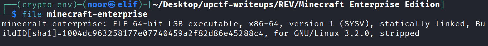
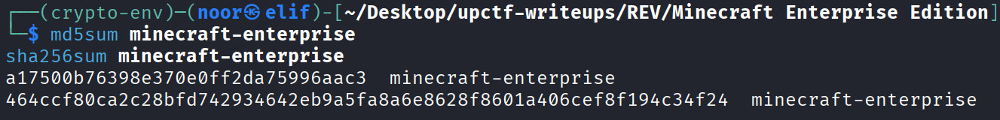
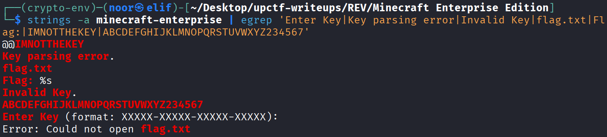
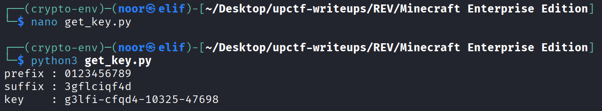
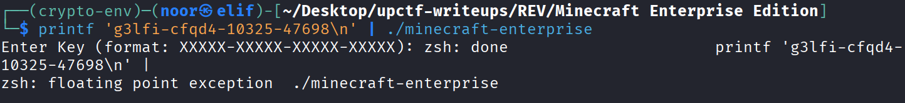
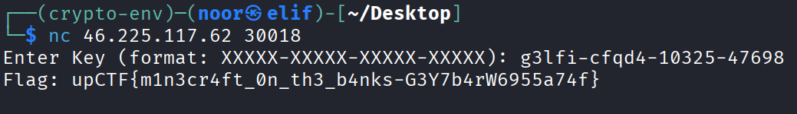

# Minecraft Enterprise Edition - Reverse Engineering Write-Up
**Category:** Reverse Engineering  
**Difficulty:** Medium  
**Challenge:** Minecraft Enterprise Edition  
**Files:** `minecraft-enterprise`

---

## TL;DR
This binary is a local license verifier. It accepts keys in the form `XXXXX-XXXXX-XXXXX-XXXXX`, normalizes them into 20 lowercase alphanumeric characters, permutes those 20 bytes, and then checks whether the last 10 transformed bytes match a value derived from the first 10.

The important part is that the verifier is completely local, so I did not need to brute force anything. Once I reconstructed the check routine, I turned it into a keygen.

The valid key I generated was:

> **`g3lfi-cfqd4-10325-47698`**

Using that key against the service returned the flag:

> **`upCTF{m1n3cr4ft_0n_th3_b4nks-G3Y7b4rW6955a74f}`**

---

## Environment / Tools
I solved this with mostly static analysis and a tiny Python reimplementation.

- **Linux:** `file`, `strings`, `sha256sum`, `md5sum`
- **Disassembly / RE:** Ghidra-style static analysis
- **Python 3:** local keygen to reproduce the verifier exactly
- **Netcat:** remote validation

---

## Artifact Fingerprint

### File identification
```bash
file minecraft-enterprise
```


Output:

```text
ELF 64-bit LSB executable, x86-64, statically linked, stripped
```

That already told me a few useful things:
- this was a native Linux binary
- it was stripped, so I needed to work from control flow and constants
- it was statically linked, so there was going to be a lot of library noise around the real logic

### Hashes (reproducibility)
```text
MD5: a17500b76398e370e0ff2da75996aac3
SHA256: 464ccf80ca2c28bfd742934642eb9a5fa8a6e8628f8601a406cef8f194c34f24
```


### Suspicious strings
```bash
strings -a minecraft-enterprise | egrep 'Enter Key|Key parsing error|Invalid Key|flag.txt|Flag:|IMNOTTHEKEY|ABCDEFGHIJKLMNOPQRSTUVWXYZ234567'
```


Relevant strings:

```text
IMNOTTHEKEY
Key parsing error.
flag.txt
Flag: %s
Invalid Key.
ABCDEFGHIJKLMNOPQRSTUVWXYZ234567
Enter Key (format: XXXXX-XXXXX-XXXXX-XXXXX):
Error: Could not open flag.txt
```

These strings immediately narrowed the problem down a lot.

I already knew:
- the program expects a fixed license format
- it opens `flag.txt` only after successful validation
- `IMNOTTHEKEY` was probably not just a joke string and likely had something to do with the derivation
- the Base32-looking alphabet was probably part of the key check

---

## Solution Steps (single consolidated section)

### Step 1 — Confirm the binary is doing a local key check
The main routine reads a line, calls a parser, and either prints `Key parsing error.` or continues into the verifier. If the verification fails, it prints `Invalid Key.`. If it succeeds, it opens `flag.txt` and prints `Flag: %s`.

That meant the challenge was not about exploiting the remote server. The only thing I needed was a valid key.

So the whole job became: **reconstruct the verifier and generate one accepted license string**.

---

### Step 2 — Reverse the parser
The parser enforces this exact external layout:

```text
XXXXX-XXXXX-XXXXX-XXXXX
```

So there are:
- 4 groups
- 5 characters per group
- 3 dashes
- total length 23

Internally, the parser strips the dashes, checks that the remaining characters are alphanumeric, and lowercases any letters.

So the verifier really works on a normalized 20-byte string:

```text
p[0..19]
```

where each byte is one lowercase alnum character.

That is important because it means uppercase vs lowercase does not matter for letters in the input. The program normalizes everything before the real check begins.

---

### Step 3 — Recover the 20-byte permutation
Before the actual comparison, the program rearranges the 20 normalized characters.

I reconstructed that transform and found that it does two simple swaps:

1. swap the first 10 bytes with the last 10 bytes  
2. swap adjacent bytes across the full 20-byte buffer

If I call the original normalized key `p` and the transformed buffer `q`, then the final mapping is:

```text
q = [
  p11, p10, p13, p12, p15, p14, p17, p16, p19, p18,
  p1,  p0,  p3,  p2,  p5,  p4,  p7,  p6,  p9,  p8
]
```

That was the first big turning point, because once I had this mapping, I knew I could work in the easier transformed space and then invert it at the end.

---

### Step 4 — Ignore the red herring and isolate the real check
There is a checksum-looking loop in the binary that uses a 256-byte table and some arithmetic seeded from `0x12345678`. At first glance it looks important, but it never affects the final acceptance decision.

The real check happens later.

The transformed 20-byte buffer `q` is split into two halves:

- `q[0:10]` = first half
- `q[10:20]` = second half

The program derives an **expected** 10-character suffix from the first half, then compares it against the second half.

So the license condition is basically:

```text
q[10:20] == f(q[0:10])
```

That is exactly the kind of structure that turns into a keygen.

---

### Step 5 — Reconstruct the derivation function
This is where the string constants made sense.

The binary computes an HMAC using:

```text
key  = "IMNOTTHEKEY"
data = q[0:10]
```

The digest path matches **HMAC-SHA256**.

After that, the program does not use the full digest directly. Instead, it:

1. takes the **first 7 bytes** of the HMAC output  
2. interprets them as a **56-bit big-endian integer**  
3. shifts that value right by **6 bits**  
4. encodes the remaining **50 bits** into **10 Base32 characters** using the alphabet:

```text
ABCDEFGHIJKLMNOPQRSTUVWXYZ234567
```

So the exact verifier logic becomes:

```text
suffix = base32_10( (first_7_bytes_of_hmac_as_u56) >> 6 )
```

and the acceptance condition is:

```text
q[10:20] == suffix
```

At that point the challenge was done conceptually. I no longer needed to reverse any more of the binary. I just needed to choose any 10-byte prefix, derive the matching suffix, and then invert the permutation.

---

### Step 6 — Turn the verifier into a keygen
I chose a very simple transformed prefix:

```text
q[0:10] = 0123456789
```

Then I ran the derivation routine on it.

Using:

```text
HMAC-SHA256(key="IMNOTTHEKEY", data="0123456789")
```

and applying the same bit slicing and Base32 encoding as the binary, I got:

```text
q[10:20] = 3GFLCIQF4D
```

The parser lowercases letters anyway, so I used:

```text
q = 01234567893gflciqf4d
```

Now I just needed to invert the permutation and recover the original normalized input `p`.

From the earlier mapping, the inverse is:

```text
p0  = q11
p1  = q10
p2  = q13
p3  = q12
p4  = q15
p5  = q14
p6  = q17
p7  = q16
p8  = q19
p9  = q18
p10 = q1
p11 = q0
p12 = q3
p13 = q2
p14 = q5
p15 = q4
p16 = q7
p17 = q6
p18 = q9
p19 = q8
```

Applying that inverse to my chosen `q` produced:

```text
p = g3lficfqd41032547698
```

After re-inserting dashes every 5 characters, I got the final license key:

> **`g3lfi-cfqd4-10325-47698`**

---

### Step 7 — Reproduce the solver in Python
I wrote a tiny keygen that mirrors the binary exactly.

```python
#!/usr/bin/env python3
import hmac
import hashlib

ALPH = "ABCDEFGHIJKLMNOPQRSTUVWXYZ234567"

def derive_suffix(prefix10: str) -> str:
    mac = hmac.new(b"IMNOTTHEKEY", prefix10.encode(), hashlib.sha256).digest()
    x = 0
    for b in mac[:7]:
        x = (x << 8) | b
    x >>= 6

    out = [""] * 10
    for i in range(9, -1, -1):
        out[i] = ALPH[x & 31]
        x >>= 5
    return "".join(out)

def inverse_permute(q: str) -> str:
    p = ["?"] * 20
    p[0]  = q[11]
    p[1]  = q[10]
    p[2]  = q[13]
    p[3]  = q[12]
    p[4]  = q[15]
    p[5]  = q[14]
    p[6]  = q[17]
    p[7]  = q[16]
    p[8]  = q[19]
    p[9]  = q[18]
    p[10] = q[1]
    p[11] = q[0]
    p[12] = q[3]
    p[13] = q[2]
    p[14] = q[5]
    p[15] = q[4]
    p[16] = q[7]
    p[17] = q[6]
    p[18] = q[9]
    p[19] = q[8]
    return "".join(p)

def hyphenate(s: str) -> str:
    return "-".join(s[i:i+5] for i in range(0, 20, 5))

prefix = "0123456789"
suffix = derive_suffix(prefix).lower()
q = prefix + suffix
p = inverse_permute(q)
key = hyphenate(p)

print("prefix :", prefix)
print("suffix :", suffix)
print("key    :", key)
```


Running it prints:

```text
key    : g3lfi-cfqd4-10325-47698
```

---

### Step 8 — Validate locally and remotely
Local validation was easy.

If I feed the generated key into the binary, it does **not** print `Invalid Key.`. Instead, it takes the success path and tries to open `flag.txt`.

Example:

```bash
printf 'g3lfi-cfqd4-10325-47698\n' | ./minecraft-enterprise
```



success-path output:

```text
Enter Key (format: XXXXX-XXXXX-XXXXX-XXXXX): zsh: done                      printf 'g3lfi-cfqd4-10325-47698\n' | 
zsh: floating point exception  ./minecraft-enterprise
```

That confirms the key is accepted locally.

Then I used the same key against the remote service:

```bash
nc 46.225.117.62 30018
```

Input:

```text
g3lfi-cfqd4-10325-47698
```

Service response:

```text
Flag: upCTF{m1n3cr4ft_0n_th3_b4nks-G3Y7b4rW6955a74f}
```


So the final flag is:

> **`upCTF{m1n3cr4ft_0n_th3_b4nks-G3Y7b4rW6955a74f}`**

---

## Final Answer
**Valid key:**  
> **`g3lfi-cfqd4-10325-47698`**

**Flag:**  
> **`upCTF{m1n3cr4ft_0n_th3_b4nks-G3Y7b4rW6955a74f}`**

---

## Notes / Takeaways
- A statically linked stripped ELF can look much scarier than it really is. Here, most of the binary was just library bulk around a small custom verifier.
- The fastest path was not patching or brute force. It was identifying that the check was a deterministic relation between the first and second half of the key.
- `IMNOTTHEKEY` looked like a joke string at first, but it turned out to be the HMAC key that made the whole verifier work.
- Once I saw the 20-byte permutation and the Base32 alphabet, the rest of the challenge turned into a clean reimplementation problem.
- This is a good reminder that license-style crackmes are often easier to solve by building a keygen than by trying to bypass the check directly.
