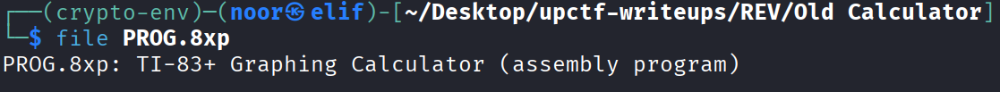
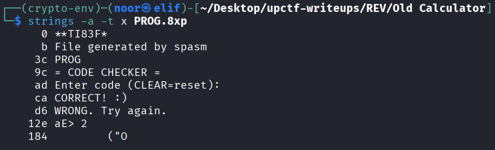
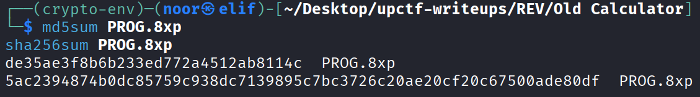
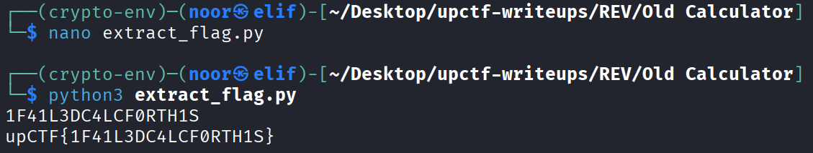

# Old Calculator - Reverse Engineering Write-Up

**Category:** Reverse Engineering  
**Difficulty:** Easy  
**Challenge:** Old Calculator  
**Files:** `PROG.8xp`

---

## TL;DR

`PROG.8xp` is not TI-BASIC — it is a **TI-83+/84+ Z80 assembly program** built with **spasm**.  
The program stores entered keys as **TI keyscan codes**, decrypts an 18-byte target buffer at runtime using a tiny LFSR/XOR routine, and compares the decrypted bytes directly against the stored input.

Recovering the decrypted keycodes and mapping them back through the program’s own display routine gives the code:

> **1F41L3DC4LCF0RTH1S**

The challenge asks us to wrap that value in the provided format, so the final flag is:

> **upCTF{1F41L3DC4LCF0RTH1S}**

---

## Environment / Tools

Static analysis was enough. No TI emulator was required.

* **Linux:** `file`, `strings`, `python3`
* **Analysis style:** payload carving, byte-level inspection, manual lifting of the verifier

---

## Artifact Fingerprint

### File identification

```bash
file PROG.8xp
# PROG.8xp: TI-83+ Graphing Calculator (assembly program)
```


The header also identifies the toolchain immediately:

```bash
strings -a -t x PROG.8xp
```


Relevant output:

```text
0      **TI83F*
b      File generated by spasm
3c     PROG
9c     = CODE CHECKER =
ad     Enter code (CLEAR=reset):
ca     CORRECT! :)
d6     WRONG. Try again.
```

So before even disassembling anything, we already know three important things:

* this is a **TI-83+ program**
* it was built with **spasm**
* it is a **code checker** with explicit success/failure branches

---

### Hashes (reproducibility)

```text
MD5:    de35ae3f8b6b233ed772a4512ab8114c
SHA256: 5ac2394874b0dc85759c938dc7139895c7bc3726c20ae20cf20c67500ade80df
```


---

### Payload layout

After the standard `.8xp` variable header, the calculator program payload begins at file offset `0x4a`:

```text
0x4a: bb 6d          ; TI asm program marker
0x4c: c3 57 9e       ; jp 0x9e57
```

That `jp` immediately skips over embedded data placed right after the entry stub.

Important file offsets:

* `0x4a` — asm payload begins
* `0x4f` — 18-byte encoded target buffer
* `0x61` — 57-byte encrypted verifier blob
* `0x9c` — `"= CODE CHECKER ="`
* `0xad` — `"Enter code (CLEAR=reset):"`
* `0xca` — `"CORRECT! :)"`
* `0xd6` — `"WRONG. Try again."`

This is the exact kind of layout you want in a small challenge binary: tiny entry stub, hidden data block, then main code.

---

## Solution Steps (single consolidated section)

### Step 1 — Quick win: identify the program type and hunt strings

The first pass was just fingerprinting.

```bash
file PROG.8xp
strings -a -t x PROG.8xp
```

That already told us this is an **assembly** program, not tokenized TI-BASIC, and that the program is a straightforward code checker. That means the shortest route is almost certainly:

1. find where the input is stored
2. find where verification happens
3. lift the compare logic
4. invert it cleanly

No need to emulate the full calculator UI unless static analysis stalls.

---

### Step 2 — Recognize the packed layout at the payload entry

The start of the asm payload is:

```text
bb 6d c3 57 9e
```

Which corresponds to:

```asm
.db 0xbb, 0x6d   ; asm program signature
jp 0x9e57
```

The important observation here is that the jump lands **past** the bytes that follow it, so the bytes immediately after the jump are not instructions — they are **embedded data**.

That data block contains two things that matter:

1. an 18-byte encoded target
2. a 57-byte encrypted routine used during verification

So even before reconstructing the whole control flow, we already know the author hid the actual compare logic behind a tiny runtime decryption step.

---

### Step 3 — Follow the input rules

The main checker loop only accepts keys in two ranges:

* `0x8e .. 0x97` → digits `0..9`
* `0x9a .. 0xb3` → letters `A..Z`

Internally, the program stores the **raw keyscan codes**, not ASCII.

Later, it converts those keyscan codes into printable characters for display using logic equivalent to:

```python
def key_to_char(a):
    if 0x8E <= a < 0x98:
        return chr(a - 0x8E + ord('0'))
    if 0x9A <= a < 0xB4:
        return chr(a - 0x9A + ord('A'))
    raise ValueError(hex(a))
```

This is the key detail that makes the challenge look slightly more exotic than it really is. The compare is not happening against ASCII bytes — it is happening against TI key codes.

---

### Step 4 — Lift the hidden verifier blob

The 57-byte blob starting at file offset `0x61` is decrypted at runtime and copied to RAM before execution.

Once lifted, the core verifier logic is effectively:

```asm
push de
ld de,$86fe
loop1:
  ld a,c
  srl a
  jr nc,$+4
  xor $B8
  ld c,a
  ld a,(hl)
  xor c
  ld (de),a
  inc hl
  inc de
  djnz loop1

ld hl,$86fe
pop de
ld b,$12
cmp_loop:
  ld a,(de)
  cp (hl)
  jr nz,fail
  inc hl
  inc de
  djnz cmp_loop
```

In plain English, the verifier does this:

1. start with an 8-bit state in register `C`
2. update it with a small right-shift/XOR feedback step
3. XOR each byte of the embedded 18-byte buffer with that evolving state
4. compare the decrypted bytes against the user-entered key buffer

So this is not a hash, and not a one-way check. It is just a reversible byte transform.

---

### Step 5 — Reconstruct the transform

The per-byte state update is:

```python
def step(a):
    carry = a & 1
    a >>= 1
    if carry:
        a ^= 0xB8
    return a & 0xFF
```

The encoded target bytes at file offset `0x4f` are:

```text
65 ea 10 ce 3d dd bb 8f 23 45 ec a7 92 a5 aa 1a 6a 66
```

The verifier starts with:

```text
C = 0xA5
```

Then for each encoded byte:

1. update `C = step(C)`
2. compute `decoded = encoded ^ C`

That yields the 18 target **keyscan codes**:

```text
8f 9f 92 8f a5 91 9d 9c 92 a5 9c 9f 8e ab ad a1 8f ac
```

Those are not directly readable yet, but once they are passed through the program’s own keycode mapping, they become:

```text
1 F 4 1 L 3 D C 4 L C F 0 R T H 1 S
```

So the expected code is:

> **1F41L3DC4LCF0RTH1S**

That string is also a nice sanity check because it clearly reads as leetspeak:

> **I FAILED CALC FOR THIS**

---

### Step 6 — Extract the code reproducibly

To avoid manual byte fiddling, I wrote a tiny extractor that reproduces the whole recovery path from the original file.

```python
# extract_flag.py
from pathlib import Path

data = Path("PROG.8xp").read_bytes()

# Encoded 18-byte target: starts right after the asm marker + jp stub
enc = data[0x4F:0x4F + 0x12]

def step(a):
    carry = a & 1
    a >>= 1
    if carry:
        a ^= 0xB8
    return a & 0xFF

def key_to_char(a):
    if 0x8E <= a < 0x98:
        return chr(a - 0x8E + ord('0'))
    if 0x9A <= a < 0xB4:
        return chr(a - 0x9A + ord('A'))
    raise ValueError(f"unexpected keycode: {a:#x}")

c = 0xA5
out = []
for b in enc:
    c = step(c)
    out.append(b ^ c)

code = ''.join(key_to_char(x) for x in out)
print(code)
print(f"upCTF{{{code}}}")
```

Run:

```bash
python3 extract_flag.py
```


Output:

```text
1F41L3DC4LCF0RTH1S
upCTF{1F41L3DC4LCF0RTH1S}
```

---

### Step 7 — Why this works

The nice thing about this challenge is that the verification logic is fully reversible once you notice two implementation details:

* the compare target is decrypted **at runtime**, not stored plainly
* the user input is stored as **calculator key codes**, not ASCII

Once both of those are clear, the rest is just bookkeeping.

There is no need for symbolic execution, brute force, or emulator-driven tracing here.

---

## Final Answer

**Flag:**

> **upCTF{1F41L3DC4LCF0RTH1S}**

---

## Notes / Takeaways

* On niche platforms, the biggest trap is often **data representation**, not algorithmic complexity.
* Here, the only real twist was that the program compares **TI keyscan codes** instead of normal ASCII.
* A short encrypted verifier blob can look intimidating at first, but small self-decrypting routines are usually faster to **lift and re-implement** than to emulate.
* Even on calculator binaries, the same classic RE workflow still wins:

  * fingerprint the file
  * locate input handling
  * identify the compare path
  * reconstruct the transform
  * re-implement it cleanly for reproducibility
